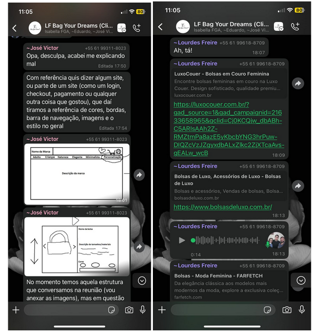
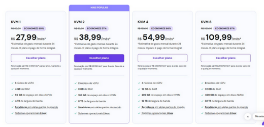
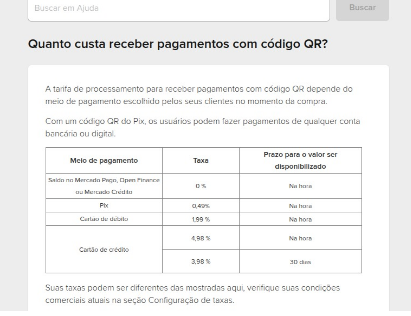
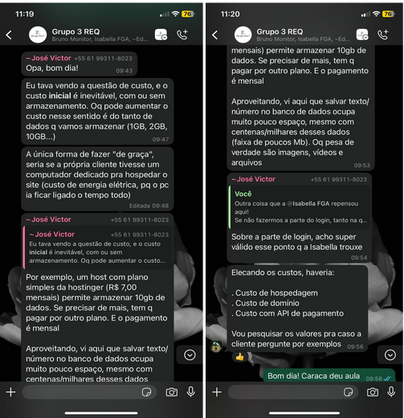

# Ata de Reunião

## Versionamento

| Versão | Data | Modificação | Responsável |
| :-: | :-: | :-: | :-: |
| 0.1 | 03/05/25 | Criação do documento | Yasmin Moreira do Nascimento

## Contexto da Reunião

* **Data:** 03/05/2025
* **Local:** Remoto (*Google Meet*)
* **Presentes:**
  * José Victor, Leonardo Barcellos, Pedro Henrique, Yasmin Moreira 
* **Ausentes:**
  * Eduardo Morais, Isabella Choukaira

## Objetivo da Reunião

Discutir e alinhar os requisitos e funcionalidades que o site deverá contemplar, além do levantamento de possíveis custos associados ao projeto.

## Tópicos Discutidos

Durante o encontro, foram levantadas as principais necessidades e expectativas para o desenvolvimento do projeto, garantindo que todos estejam alinhados quanto às demandas e prioridades. Foram abordado também os possivéis custos.

## Evidências do Processo de Engenharia de Requisitos

- **Brainstorming com cliente e equipe:**  
  - Discussão inicial com a cliente para levantar o máximo de ideias sobre funcionalidades, diferenciais e problemas comuns em e-commerce.
  
- **Análise de Concorrência:**  
  - Avaliação de e-commerces concorrentes (líderes de mercado e similares) para identificar padrões de mercado, recursos presentes e lacunas a serem aproveitadas.
  

  

  
  
- **Negociação com cliente:**  
  - Acordo entre funcionalidades desejadas pela cliente e viabilidade técnica da equipe, mantendo o foco nas necessidades que o sistema pode resolver de forma eficaz.
  
  
- **Análise de Custo-Benefício de Requisitos:**  
  - Avaliação de requisitos que atendam às mesmas necessidades com diferentes níveis de complexidade, buscando soluções viáveis para a equipe implementar.

  

  

  

---

## Evidências do Processo de Engenharia de Software

- **Análise de custos e hospedagem:**  
  - Opções de hospedagem analisadas:
    - Alternativa VPS paga: [Hostinger](https://www.hostinger.com/br/servidor-vps)
  - API de pagamentos considerada: [Mercado Pago](https://www.mercadopago.com.br/ajuda/custo-receber-pagamentos_220)

- **Viabilidade Técnica:**  
  - Discussão sobre uso de tecnologias modernas (React, Vite, Django), com foco em soluções gratuitas ou de baixo custo.
  
---

## Próximos Passos

* Prototipar e validação.