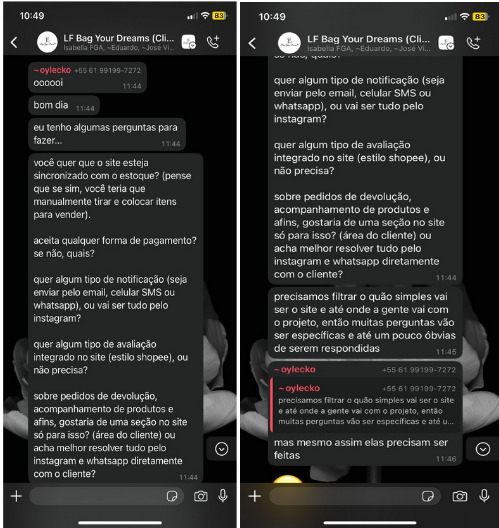
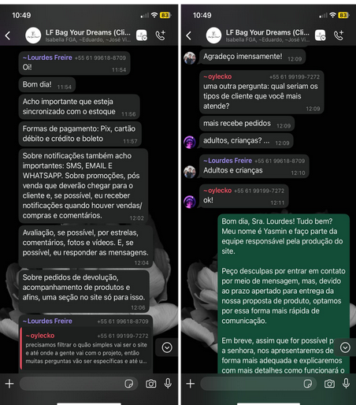
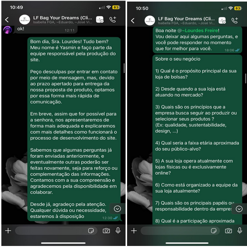
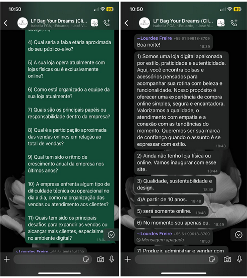
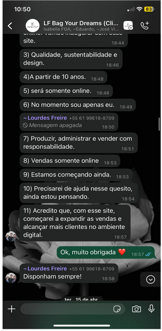

# Ata de Reunião 

## Versionamento

| Versão | Data | Modificação | Responsável |
| :-: | :-: | :-: | :-: |
| 0.1 | 05/04/25 | Criação do Documento | Yasmin Moreira do Nascimento |

## Contexto

- **Data:** 05/04/2025  
- **Local:** Remoto (via WhatsApp)  
- **Tipo de interação:** Entrevista assíncrona  

## Objetivo

Levantar requisitos iniciais por meio de entrevista com a cliente, identificando necessidades, cotidiano e expectativas com relação ao sistema.

## Evidências de Execução – Engenharia de Requisitos (ER)

- **Técnica aplicada:** Entrevista estruturada via WhatsApp, devido à indisponibilidade da cliente para reuniões síncronas.  
- **Conteúdo abordado:**  
  - Perguntas sobre as principais dificuldades enfrentadas na gestão atual.  
  - Necessidades específicas em relação ao sistema.  
  - Funcionalidades desejadas ou esperadas.  
- **Justificativa:** A entrevista informal por mensagens se mostrou viável e eficiente para levantamento inicial de requisitos, preservando o foco da etapa de elicitação.

## Evidências de Execução – Engenharia de Software (ESW)

- **ENTREVISTA**
- **Registro:**  

  

  

  

  

   

- **Decisão metodológica:** A equipe optou por técnicas flexíveis e adaptáveis de elicitação para mitigar riscos de indisponibilidade da cliente, mantendo a eficiência do processo.

## Próximos Passos

- Consolidar os requisitos levantados com base nas respostas da cliente.  
- Validar essas informações com a cliente em uma futura reunião síncrona.  
- Iniciar a elaboração dos artefatos de requisitos (ex: user stories, protótipos de baixa fidelidade).
