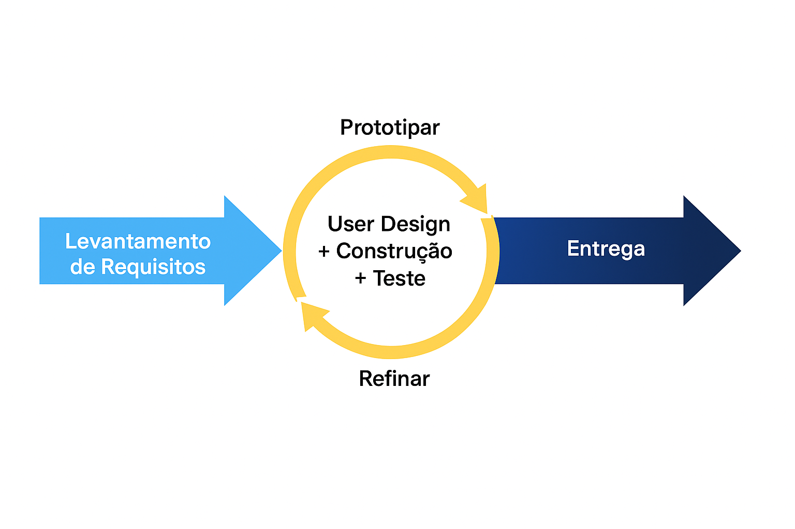

| **Ciclo** | **Início** | **Fim** | **Objetivo Principal** | **Entregas Esperadas** | **Validação do Cliente** |
|:---:| :---: | :---: | :---: | :---: | :---: |
| **1** | 22/04/2025 | 04/05/2025 | Planejamento e Definição de Backlog | \- Definição do backlog inicial.  \- Configuração da arquitetura (React, Python, MongoDB, Docker).  \- Ambiente de desenvolvimento pronto. | Revisão do backlog e confirmação de prioridades. |
| **2** | 05/05/2025 | 18/05/2025 | Interface inicial do sistema | \- Catálogo de produtos;  \- Sistema de personalização de cada produto;  \- Sistema de autenticação. | Validação do catálogo, sistema de personalização de produtos, e sistema de autenticação. |
| **3** | 19/05/2025 | 28/05/2025 | Perfil do usuário, pagamento através da plataforma| \- Edição de dados da conta do usuário;  \- Integração com sistema de pagamento externo. | Validação da área de perfil do usuário e do fluxo de pedidos.
| **4** | 29/05/2025 | 08/06/2025 | Notificações automáticas e mecanismo de desconto, área de administração | \- Notificações automáticas (e-mail) para confirmação de pedidos.   \- Descontos por recomendação (código de desconto ou links).   \- Gerenciamento de estoque;   \- Gerenciamento de situação dos pedidos. | Validação do sistema de notificações por e-mail; validação do sistema de descontos por divulgação do software. Validação das funcionalidades do administrador.
| **5** | 09/06/2025 | 18/06/2025 | Avaliação dos produtos, carrinho de compras  | \- Implementação do sistema de avaliação de produtos (estrelas, comentários, imagens, vídeos).   \- Implementação do carrinho de compras. | Feedback das avaliações e validação do fluxo do carrinho de compras.
| **6** | 19/06/2025 | 28/06/2025 | Lançamento Final e Monitoramento | \- Lançamento final do sistema para todos os usuários;  \- Monitoramento pós-lançamento e ajustes com base nos primeiros feedbacks. | Homologação pela cliente e aprovação final. Feedback dos primeiros usuários reais e ajustes pós-lançamento. |

**Considerações importantes:**

1. **Datas de início e fim:** Cada ciclo tem a duração de 9 dias, começando em 22/04/2025 e finalizando em 13/07/2025, distribuindo as entregas parciais ao longo do tempo, com exceção do ciclo 1 e 2. 

2. **Etapas da metodologia RAD a cada ciclo:** Inicialmente, será realizada a etapa de **levantamento de requisitos**, em conjunto com a cliente. Em seguida, ocorrerá o **User Design** (prototipação), com foco na validação das necessidades e ajustes baseados em feedbacks. Em cada ciclo de entrega, serão realizadas a **construção** rápida e incremental de cada User Story, seguida de **testes** frequentes para validação e, posteriormente, a entrega das funcionalidades ao cliente. No último ciclo (cutover), será realizada a implantação completa do sistema.**

3. **Ciclos:** O RAD é centrado na iteratividade, prototipação rápida, feedback constante dos usuários e ajustes contínuos, e o nosso ciclo ilustrado na figura 2 segue a seguinte lógica: 

    >a. **Levantamento de Requisitos** - Corresponde à fase em que são resgatadas as necessidades dos stakeholders e traduzidas para implementações de software a fim de identificar e resolver problemas.
    >
    >b. **User Design** – o foco é entender as necessidades do usuário e fazer ajustes com base em feedbacks constantes. Reflete bem a filosofia RAD, que se apoia fortemente em protótipos funcionais para refinar as ideias com os usuários.
    >
    >c. **Construção** – Corresponde à fase de desenvolvimento e codificação rápida dos componentes definidos anteriormente.
    >
    >d. **Testes** – Encaixa-se na fase de validação, onde o produto é testado frequentemente para detectar falhas cedo.
    >
    >e. **Entrega** - Diz respeito à fase em que todas as funcionalidades do software desenvolvido são entregues e prontas para uso.
    >

A sequência circular a sugere um **processo iterativo**:

 
<strong>Figura 2:</strong> Ciclos do processo RAD

