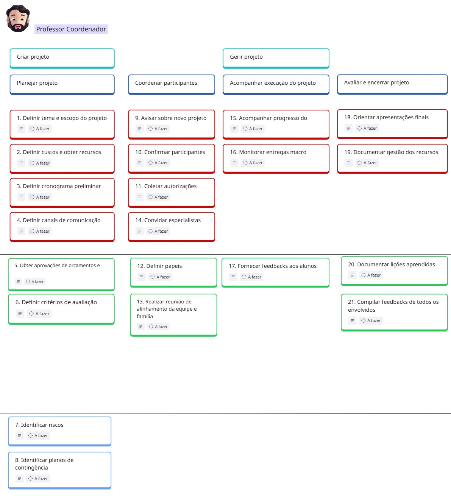
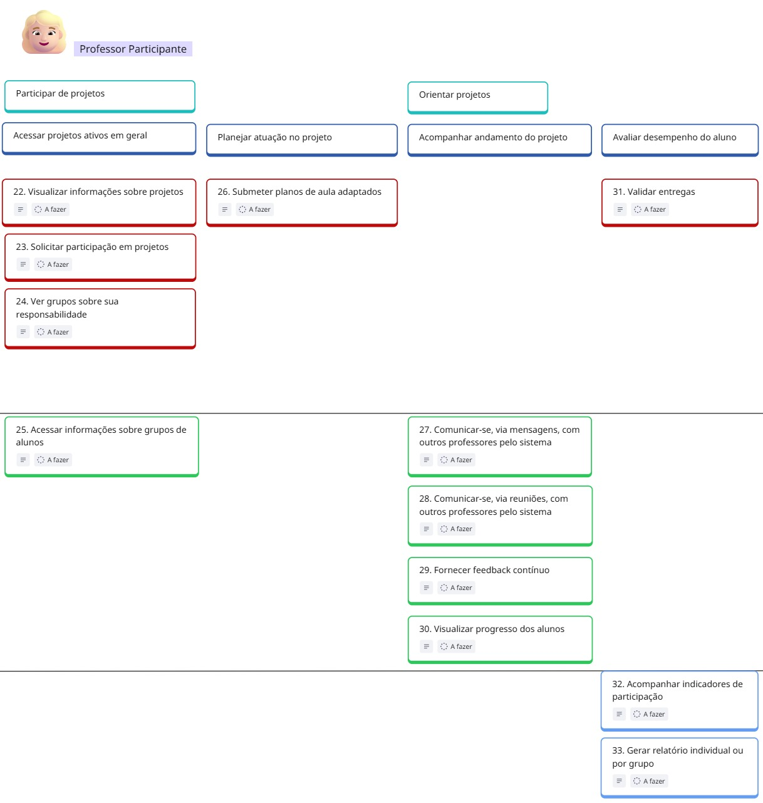
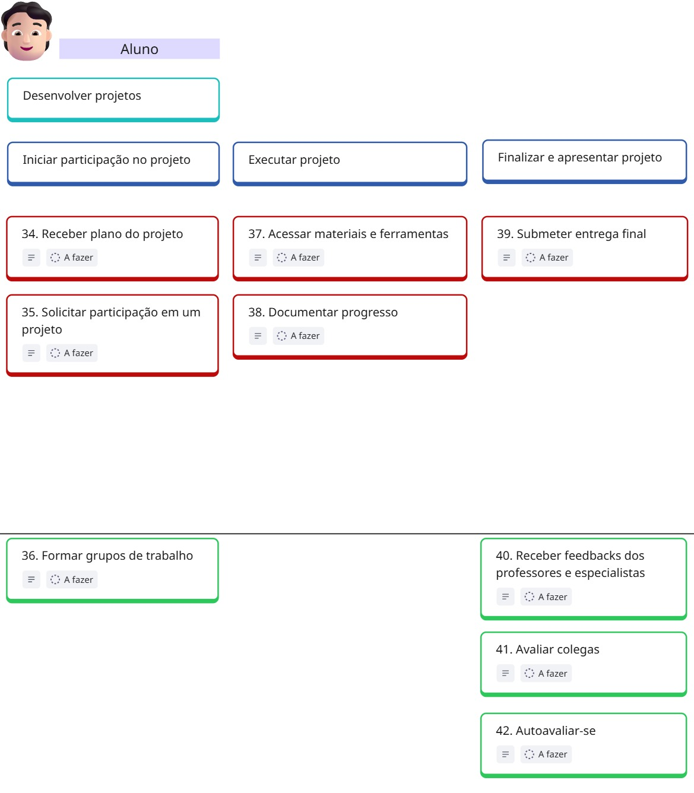
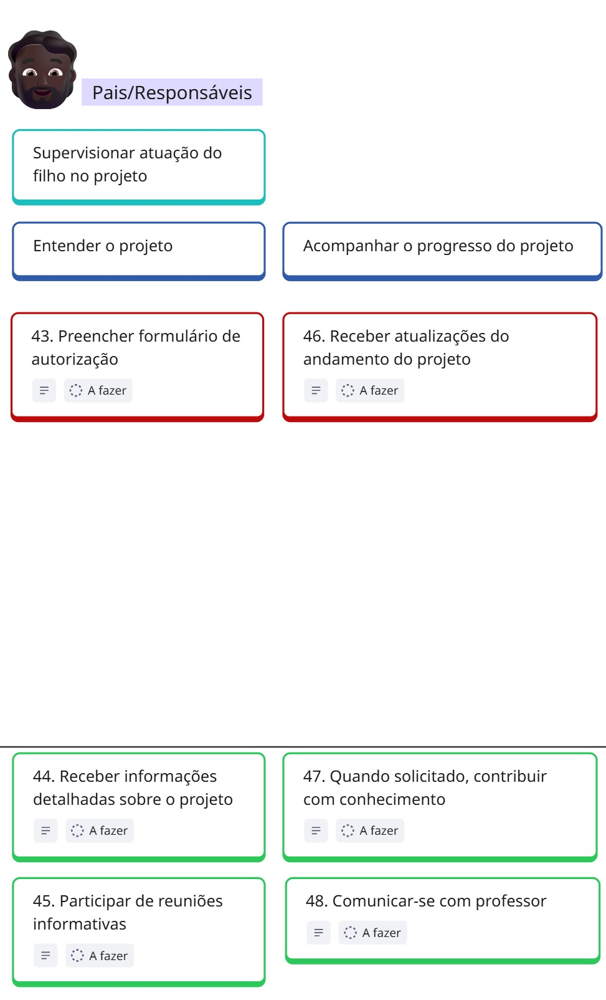
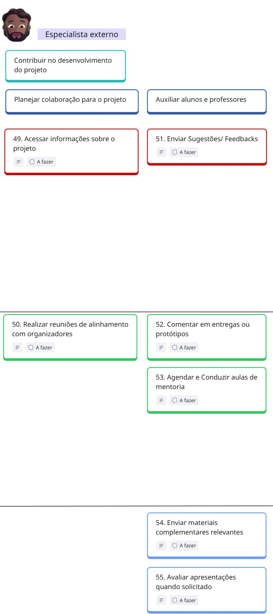
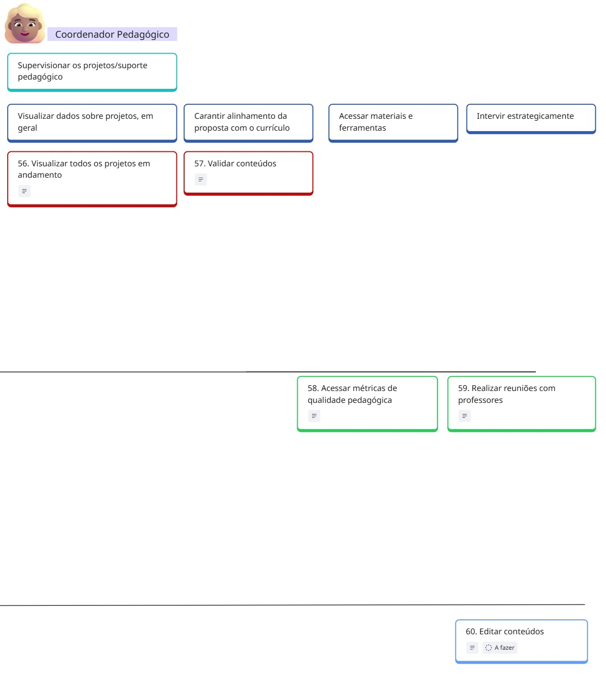

# User Story Mapping

___________________________________________________________________________________

## Empresa EduConnect

O EduConnect é uma iniciativa que surgiu a partir da experiência de três educadores, que identificaram significativas dificuldades enfrentadas pelas instituições de ensino na organização e acompanhamento de projetos interdisciplinares e atividades extracurriculares. Diante desse cenário,o objetivo do negócio é oferecer uma plataforma única, acessível e eficiente, que ajude a planejar, gerenciar e avaliar esses projetos de forma integrada.

___________________________________________________________________________________

## Quadro do USM

<iframe width="768" height="432" src="https://miro.com/app/live-embed/uXjVJf2K8Fo=/?embedMode=view_only_without_ui&moveToViewport=-5451,4116,6013,2982&embedId=719770441591" frameborder="0" scrolling="no" allow="fullscreen; clipboard-read; clipboard-write" allowfullscreen></iframe>

___________________________________________________________________________________
## Personas do EduConnect

| **Persona**               | **Papel no projeto**               | **Necessidades/Expectativas**                                      |
|---------------------------|------------------------------------|-------------------------------------------|
| **Professor Coordenador** | Planeja e gerencia os projetos.    | Precisa de controle geral e visão estratégica. |
| **Professor Participante**| Contribui com sua área no projeto. | Precisa de acesso às informações e boa comunicação. |
| **Aluno**                 | Participa ativamente dos projetos. | Busca uma plataforma intuitiva e interativa. |
| **Pais/Responsáveis**     | Acompanham o progresso dos filhos. | Precisam de informações claras e atualizações regulares. |
| **Especialista Externo**  | Colabora com conhecimento prático. | Precisa de orientações claras e integração com a equipe. |
| **Coordenador Pedagógico**| Garante o alinhamento pedagógico.  | Precisa de visão global e dados para avaliar resultados. |

### Professor Coodenador 

| **Requisito Funcional**                                | **User Story**                                                                                                                                                                                                 | **Priorização** | **MVP** |
|---------------------------------------------------------|----------------------------------------------------------------------------------------------------------------------------------------------------------------------------------------------------------------|-----------------|--------|
| RF01 - Definir tema e escopo do projeto                | US01 - Como Professor coordenador, quero poder definir tema e escopo do projeto, para que eu tenha clareza e foco durante a execução do projeto.                                                             | 5.33            | X      |
| RF02 - Definir custos e obter recursos                 | US02 - Como professor coordenador, quero poder definir custos e obter recursos para o projeto, para que eu possa gerenciar o orçamento e garantir o financiamento necessário para a execução do projeto.    | 5.20            | X      |
| RF03 - Definir cronograma preliminar                   | US03 - Como professor coordenador quero poder definir o cronograma preliminar para o projeto, para que eu possa organizar as etapas e garantir o cumprimento dos prazos.                                     | 5.00            | X      |
| RF04 - Definir canais de comunicação                   | US04 - Como professor coordenador quero poder definir os canais de comunicação que serão utilizados no projeto, pela plataforma, para que a comunicação entre os envolvidos seja eficiente e organizada.    | 5.33            | X      |
| RF05 - Obter aprovações de orçamentos e recursos       | US05 - Como professor coordenador quero poder obter aprovações de orçamentos e recursos para o projeto, para garantir o financiamento necessário e assegurar a execução adequada do projeto.                | 1.25            |        |
| RF06 - Definir critérios de avaliação                  | US06 - Como professor coordenador, quero definir critérios de avaliação para o projeto, para garantir uma avaliação clara e justa.                                                                           | 2.00            |        |
| RF07 - Identificar riscos                              | US07 - Como professor coordenador, quero identificar os riscos do projeto, para que eu possa antecipar problemas e planejar ações de mitigação.                                                              | 0.75            |        |
| RF08 - Identificar planos de contingência              | US08 - Como professor coordenador, quero identificar planos de contingência para o projeto, para que possamos estar preparados para enfrentar imprevistos e garantir a continuidade das atividades.         | 0.75            |        |
| RF09 - Avisar sobre novo projeto                       | US09 - Como professor coordenador, quero avisar sobre novos projetos, para que outros participantes possam ser informados e solicitar participação.                                                          | 5.33            | X      |
| RF10 - Confirmar participantes                         | US10 - Como professor coordenador, quero confirmar os participantes do projeto, para garantir que todos estejam devidamente registrados e possam contribuir nas atividades.                                | 5.20            | X      |
| RF11 - Coletar autorizações                            | US11 - Como professor coordenador, quero coletar autorizações dos responsáveis dos alunos, para garantir que todos estejam formalmente aprovados para participar do projeto.                                | 5.33            | X      |
| RF12 - Definir papéis                                  | US12 - Como professor coordenador, quero definir os papéis dos participantes no projeto, para que as responsabilidades fiquem claras e o trabalho seja organizado.                                           | 2.00            |        |
| RF13 - Realizar reunião de alinhamento da equipe       | US13 - Como professor coordenador, quero realizar reunião de alinhamento com a equipe e as famílias, para compartilhar informações, alinhar expectativas e fortalecer a parceria no desenvolvimento do projeto. | 1.25            |        |
| RF14 - Convidar especialistas externos                 | US14 - Como professor coordenador, quero convidar especialistas externos para o projeto, para que possamos contar com conhecimentos especializados que enriqueçam e qualifiquem as atividades desenvolvidas. | 3.65            | X      |
| RF15 - Acompanhar progresso do trabalho                | US15 - Como professor coordenador, quero acompanhar o progresso do trabalho no projeto, para garantir que as atividades estejam sendo realizadas conforme o planejado e os prazos sejam cumpridos.         | 5.33            | X      |
| RF16 - Monitorar entregas macro (marcos do projeto)    | US16 - Como professor coordenador, quero monitorar os marcos do projeto, para acompanhar os principais acontecimentos e garantir que as entregas importantes sejam realizadas no prazo.                      | 8.00            | X      |
| RF17 - Fornecer feedbacks aos alunos                   | US17 - Como professor coordenador, quero fornecer feedbacks aos alunos, para que eles possam entender seu desempenho, identificar pontos de melhoria e se motivar no processo de aprendizagem.               | 2.00            |        |
| RF18 - Orientar apresentações finais                   | US18 - Como professor coordenador, quero orientar as apresentações finais do projeto, para garantir que os alunos estejam preparados e que os resultados sejam apresentados de forma clara e organizada.     | 5.20            | X      |
| RF19 - Documentar gestão dos recursos                  | US19 - Como professor coordenador, quero documentar a gestão dos recursos do projeto, para garantir transparência, controle financeiro e facilitar a prestação de contas.                                    | 3.33            | X      |
| RF20 - Documentar lições aprendidas                   | US20 - Como professor coordenador, quero documentar as lições aprendidas durante o projeto, para registrar conhecimentos adquiridos e melhorar projetos futuros.                                             | 1.25            |        |
| RF21 - Compilar feedbacks de todos os envolvidos       | US21 - Como professor coordenador, quero compilar os feedbacks de todos os envolvidos no projeto, para obter uma visão completa sobre o desempenho, identificar pontos fortes e oportunidades de melhoria.   | 1.25            |        |

### Professor Participante 

| **Requisito Funcional**                       | **User Story**                                                                                                                                                                                                                               | **Priorização** | **MVP** |
|-----------------------------------------------|-----------------------------------------------------------------------------------------------------------------------------------------------------------------------------------------------------------------------------------------------|-----------------|--------|
| RF22 - Visualizar informações sobre projetos  | US22 - Eu, como professor participante, quero poder visualizar informações gerais sobre projetos, para compreender o seu contexto específico.                                                                                                | 5.00            | X      |
| RF23 - Solicitar participação em projetos     | US23 - Eu, como professor participante, quero poder solicitar participação em um projeto, para que eu possa auxiliar a adaptação dos conteúdos e acompanhar o progresso dos alunos.                                                        | 2.60            | X      |
| RF24 - Ver grupos sobre sua responsabilidade  | US24 - Eu, como professor participante, quero poder visualizar os grupos de alunos de um projeto que estão sob minha responsabilidade, para que eu possa direcionar adequadamente minhas contribuições ao projeto.                         | 2.60            | X      |
| RF25 - Acessar informações sobre grupos       | US25 - Eu, como professor participante, quero ser capaz de acessar informações específicas sobre o progresso do trabalho e as entregas de cada grupo cadastrado em um projeto.                                                              | 2.00            |        |
| RF26 - Submeter planos de aula adaptados      | US26 - Eu, como professor participante, quero poder submeter planos de aula adaptados para adequar os conteúdos de minha especialidade ao contexto do projeto.                                                                              | 3.20            | X      |
| RF27 - Comunicação via mensagens              | US27 - Eu, como professor participante, quero ser capaz de me comunicar, via mensagens, com o professor coordenador e os outros professores participantes pelo sistema, para trocarmos assincronamente informações pertinentes ao projeto. | 2.00            |        |
| RF28 - Comunicação via reuniões               | US28 - Eu, como professor participante, quero ser capaz de me comunicar, via reuniões, com o professor coordenador e os outros professores participantes pelo sistema, para trocarmos sincronamente informações pertinentes ao projeto.   | 2.00            |        |
| RF29 - Fornecer feedback contínuo             | US29 - Eu, como professor participante, quero poder fornecer feedback contínuo, via mensagens, aos alunos/grupos acerca de seu trabalho e entregas, para contribuir com suas.                                                              | 2.00            |        |
| RF30 - Visualizar progresso dos alunos        | US30 - Eu, como professor participante, quero visualizar o progresso do trabalho dos alunos, para que eu possa estar ciente acerca do andamento do projeto e da compreensão dos alunos sobre os conteúdos.                                | 2.00            |        |
| RF31 - Validar entregas                       | US31 - Eu, como professor participante, quero validar as entregas dos grupos, com relação à minha especialidade, para confirmar sua adequação às exigências dos conteúdos.                                                                 | 3.20            | X      |
| RF32 - Acompanhar indicadores de participação | US32 - Eu, como professor participante, quero ser capaz de acompanhar os indicadores, estabelecidos pelo professor coordenador, de participação dos alunos no projeto, para que eu tenha ciência sobre a sua adesão à proposta.           | 0.75            |        |
| RF33 - Gerar relatório individual ou por grupo| US33 - Eu, como professor participante, quero poder obter relatórios individuais e de grupo os quais compilem todo desempenho na execução do trabalho e nas entregas dos alunos, para viabilizar a minha análise desses dados.           | 0.75            |        |

### Aluno

| **Requisito Funcional**                       | **User Story**                                                                                                                                                                                                                                 | **Priorização** | **MVP** |
|-----------------------------------------------|--------------------------------------------------------------------------------------------------------------------------------------------------------------------------------------------------------------------------------------------------|-----------------|--------|
| RF34 - Receber plano do projeto               | US34 - Eu, como aluno, quero receber o plano do projeto em que estou cadastrado para compreender o seu contexto específico e suas exigências.                                                                                                 | 5.00            | X      |
| RF35 - Solicitar participação em um projeto   | US35 - Eu, como aluno, quero solicitar a participação em um projeto, para que eu possa iniciar a participação nesse projeto.                                                                                                                  | 3.33            | X      |
| RF36 - Formar grupos de trabalho              | US36 - Eu, como aluno, quero poder formar grupos de trabalho, para que esteja apto a iniciar a execução de um projeto.                                                                                                                         | 2.00            |        |
| RF37 - Documentar progresso                   | US37 - Eu, como aluno, quero ser capaz de acessar materiais e ferramentas disponibilizadas pelos professores coordenador e participantes para a execução adequada do projeto.                                                                 | 5.33            | X      |
| RF38 - Submeter entrega final                 | US38 - Eu, como aluno, quero poder documentar o progresso de meus trabalhos para que eu seja acompanhado adequadamente pelos professores coordenador, participantes e meus responsáveis.                                                       | 3.33            | X      |
| RF39 - Receber feedbacks dos professores      | US39 - Eu, como aluno, quero poder submeter a entrega final de meu grupo, para que essa possa ser devidamente avaliada e validada pelos professores coordenador e participantes.                                                              | 5.20            | X      |
| RF40 - Avaliar colegas                        | US40 - Eu, como aluno, quero ser capaz de receber feedbacks dos professores coordenador e participantes (especialistas) para que eu possa ter a ciência de quão adequados estão os meus trabalhos e entregas.                                | 3.33            |        |
| RF41 - Autoavaliar-se                         | US41 - Eu, como aluno, quero, ao final de um projeto, avaliar os meus colegas de grupo quanto à sua contribuição aos trabalhos e entregas, para contribuir para uma avaliação geral justa de todos os integrantes do grupo.                 | 1.33            |        |
| RF42 - Preencher formulário de autorização    | US42 - Eu, como aluno, quero, ao final do projeto, poder avaliar o meu próprio desempenho em trabalhos e entregas, para que eu possa identificar pontos de melhoria em minha participação.                                                     | 1.33            |        |

### Professor Coordenador 
{ width="500" style="display: block; margin: 0 auto;" }

| **Requisito Funcional**                                 | **User Story**                                                                                                                                                                                                                       | **Priorização** | **MVP** |
|---------------------------------------------------------|----------------------------------------------------------------------------------------------------------------------------------------------------------------------------------------------------------------------------------------|-----------------|--------|
| RF43 - Receber informações detalhadas sobre o projeto   | US43 - Eu, como pai/responsável, quero preencher o formulário de autorização, para que meu filho possa participar das atividades do projeto de forma regularizada e segura.                                                          | 5.30            | X      |
| RF44 - Participar de reuniões informativas              | US44 - Eu, como pai/responsável, quero receber informações detalhadas sobre o projeto, para que eu possa acompanhar de forma abrangente o envolvimento do meu filho.                                                                | 2.00            |        |
| RF45 - Receber atualizações do andamento do projeto     | US45 - Eu, como pai/responsável, quero participar de reuniões informativas, para que eu possa compreender o meu papel e como posso apoiar o desenvolvimento do projeto e do meu filho.                                               | 2.00            |        |
| RF46 - Quando solicitado, contribuir com conhecimento    | US46 - Eu, como pai/responsável, quero receber atualizações do andamento do projeto, para que eu esteja sempre ciente do progresso e das possíveis necessidades do meu filho.                                                        | 3.33            | X      |
| RF47 - Comunicar-se com professor                       | US47 - Eu, como pai/responsável, quero, quando solicitado, contribuir com conhecimento ou experiência, para enriquecer o projeto e oferecer uma perspectiva diferente aos alunos.                                                     | 1.20            |        |
| RF48 - Acessar informações sobre o projeto              | US48 - Eu, como pai/responsável, quero poder comunicar-me com o professor, para que eu possa tirar dúvidas e discutir o desempenho ou necessidades do meu filho no projeto.                                                           | 1.20            |        |

### Especialista Externo
{ width="500" style="display: block; margin: 0 auto;" }

| **Requisito Funcional**                             | **User Story**                                                                                                                                                                                                                   | **Priorização** | **MVP** |
|-----------------------------------------------------|----------------------------------------------------------------------------------------------------------------------------------------------------------------------------------------------------------------------------------|-----------------|--------|
| RF49 - Realizar reuniões de alinhamento com organizadores | US49 - Eu, como especialista externo, quero acessar informações sobre o projeto, para que eu possa entender o contexto e me preparar para minhas contribuições.                                                             | 5.00            | X      |
| RF50 - Enviar sugestões/feedbacks                   | US50 - Eu, como especialista externo, quero realizar reuniões de alinhamento com os organizadores do projeto, para que eu possa alinhar minhas expectativas e compreender meu papel.                                           | 2.00            |        |
| RF51 - Comentar em entregas ou protótipos           | US51 - Eu, como especialista externo, quero enviar sugestões/feedbacks sobre o projeto, para que as equipes possam aprimorar o trabalho desenvolvido.                                                                          | 3.33            | X      |
| RF52 - Comentar entregas dos alunos                 | US52 - Eu, como especialista externo, quero comentar em entregas ou protótipos dos alunos, para que eu possa fornecer insights práticos e direcionar o desenvolvimento.                                                        | 2.00            |        |
| RF53 - Agendar e conduzir aulas de mentoria         | US53 - Eu, como especialista externo, quero agendar e conduzir aulas de mentoria, para que eu possa compartilhar meus conhecimentos e experiências diretamente com os alunos.                                                  | 1.25            |        |
| RF54 - Enviar materiais complementares relevantes   | US54 - Eu, como especialista externo, quero enviar materiais complementares relevantes, para que eu possa enriquecer o aprendizado dos alunos e fornecer recursos adicionais.                                                  | 1.20            |        |
| RF55 - Avaliar apresentações quando solicitado      | US55 - Eu, como especialista externo, quero avaliar apresentações quando solicitado, para que eu possa fornecer feedback construtivo sobre o desempenho dos alunos.                                                            | 1.20            |        |

### Coordenador Pedagógico

| **Requisito Funcional**                    | **User Story**                                                                                                                                                                                                                  | **Priorização** | **MVP** |
|--------------------------------------------|--------------------------------------------------------------------------------------------------------------------------------------------------------------------------------------------------------------------------------|-----------------|--------|
| RF56 - Visualizar todos os projetos em andamento | US56 - Eu, como coordenador pedagógico, quero visualizar todos os projetos em andamento, para que eu possa ter uma visão panorâmica e acompanhar o progresso de cada um.                                                      | 5.33            | X      |
| RF57 - Validar conteúdos                    | US57 - Eu, como coordenador pedagógico, quero validar conteúdos relacionados aos projetos, para garantir o alinhamento com os objetivos institucionais e a qualidade educacional.                                               | 3.20            | X      |
| RF58 - Acessar métricas de qualidade pedagógica | US58 - Eu, como coordenador pedagógico, quero acessar métricas de qualidade pedagógica, para que eu possa analisar o impacto educacional dos projetos e tomar decisões estratégicas.                                          | 1.25            |        |
| RF59 - Realizar reuniões com professores   | US59 - Eu, como coordenador pedagógico, quero realizar reuniões com professores, para que eu possa oferecer orientação estratégica e garantir a coesão pedagógica entre os projetos.                                          | 2.00            |        |
| RF60 - Editar conteúdos                     | US60 - Eu, como coordenador pedagógico, quero poder editar conteúdos, para que eu possa ajustar informações e garantir a consistência e relevância dos materiais pedagógicos.                                                 | 1.20            |        |

### Técnica de Priorização: WSJF + MoSCoW

No projeto EduConnect, a priorização das funcionalidades foi feita combinando dois métodos: WSJF e MoSCoW. Essa abordagem permite tomar decisões mais estratégicas sobre o que desenvolver primeiro, levando em conta impacto, custo e urgência.

 **1. WSJF – Weighted Shortest Job First**

O WSJF (Trabalho Ponderado mais Curto Primeiro) é uma técnica usada para priorizar tarefas com base em três fatores:

- **CoD (Custo do Atraso):** representa o impacto financeiro ou de oportunidade que a não implementação de uma funcionalidade pode causar.
- **CoR (Custo do Trabalho em Andamento):** considera os custos contínuos enquanto a tarefa estiver em execução (como esforço da equipe e manutenção).
- **Tamanho do Trabalho:** mede o esforço necessário para realizar a funcionalidade, com base em pontos (geralmente usando a sequência de Fibonacci: 1, 2, 3, 5, 8, 13...).

**Fórmula:**

WSJF = (CoD + CoR) / Tamanho do Trabalho

Quanto maior o WSJF, mais vantajoso é realizar aquela funcionalidade primeiro.

**2. Critério MoSCoW**

Após calcular o WSJF, as funcionalidades são classificadas com base no modelo **MoSCoW**, que divide as demandas em quatro categorias:

- 🔴 **Must Have (Essenciais):**  
  `WSJF > 2.0`  
  Funcionalidades indispensáveis para o funcionamento mínimo do produto (MVP). Sem elas, o sistema não opera.

- 🟢 **Should Have (Importantes):**  
  `1.0 ≤ WSJF ≤ 2.0`  
  Funcionalidades importantes que aumentam a eficiência, mas não são críticas. São priorizadas para uma próxima versão (Release 2.0).

- 🔵 **Could Have (Desejáveis):**  
  `WSJF < 1.0`  
  Funcionalidades que agregam valor ou diferencial competitivo, mas que só serão incluídas se houver tempo e recursos (Release 3.0).

- 🟡 **Won’t Have (Não essenciais neste momento):**  
  Funcionalidades que não serão desenvolvidas nesta fase. Podem ser consideradas no futuro ou descartadas

## Critérios de Aceitação para as US presentes no MVP

<table border="5">
  <tr style="background-color:rgb(194, 194, 194); color: black;">
    <th>ID</th>
    <th empty>Critérios de Aceitação (MVP)</th>
  </tr>

  <!-- US01 -->
  <tr>
    <td rowspan="2" empty><strong>US01</strong></td>
    <td empty><strong>1. O sistema deve permitir cadastrar:  - Título do projeto (máx. 100 caracteres). - Descrição detalhada do tema (mín. 3 linhas). - Limites claros do escopo (inclusões e exclusões).</strong></td>
  </tr>
  <tr>
    <td empty><strong>2. Deve gerar um documento resumo em PDF para confirmação.</strong></td>
  </tr>

  <!-- US02 -->
  <tr>
    <td rowspan="2" empty><strong>US02</strong></td>
    <td empty><strong>1. Deve permitir inserir:  - Itens de custo (recursos humanos, materiais, serviços). - Valor estimado por item (com validação de formato monetário). - Fontes de recursos (verba institucional, patrocínios).</strong></td>
  </tr>
  <tr>
    <td empty><strong>2. Deve calcular automaticamente o custo total do projeto.</strong></td>
  </tr>

  <!-- US03 -->
  <tr>
    <td rowspan="2" empty><strong>US03</strong></td>
    <td empty><strong>1. Deve permitir cadastrar etapas/marcos com:  - Data de início e término. - Responsável por cada etapa.</strong></td>
  </tr>
  <tr>
    <td empty><strong>2. Deve validar conflitos de datas.</strong></td>
  </tr>

  <!-- US04 -->
  <tr>
    <td rowspan="2" empty><strong>US04</strong></td>
    <td empty><strong>1. Deve oferecer opções pré-definidas:  - E-mail institucional. - Fórum na plataforma. - Aplicativo de mensagens.</strong></td>
  </tr>
  <tr>
    <td empty><strong>2. Deve notificar todos os participantes sobre os canais escolhidos.</strong></td>
  </tr>

  <!-- US09 -->
  <tr>
    <td rowspan="2" empty><strong>US09</strong></td>
    <td empty><strong>1. Deve permitir publicar anúncio com:  - Título. - Descrição resumida. - Link para detalhes.</strong></td>
  </tr>
  <tr>
    <td empty><strong>2. O anúncio deve ser distribuído para:  - Professores da instituição. - Alunos de séries relevantes.</strong></td>
  </tr>

  <!-- US10 -->
  <tr>
    <td rowspan="2" empty><strong>US10</strong></td>
    <td empty><strong>1. Deve listar todos os interessados (via US09).</strong></td>
  </tr>
  <tr>
    <td empty><strong>2. Permitir ao coordenador:  - Aprovar/rejeitar participantes. - Atribuir função (ex: "Pesquisador", "Suporte").</strong></td>
  </tr>

  <!-- US11 -->
  <tr>
    <td rowspan="2" empty><strong>US11</strong></td>
    <td empty><strong>1. Deve gerar formulário de autorização com:  - Termo de consentimento. - Campos para dados do responsável. - Assinatura digital.</strong></td>
  </tr>
  <tr>
    <td empty><strong>2. Permitir envio direto aos responsáveis via e-mail.</strong></td>
  </tr>

  <!-- US14 -->
  <tr>
    <td rowspan="2" empty><strong>US14</strong></td>
    <td empty><strong>1. Deve permitir cadastrar especialista com:  - Nome. - Área de expertise. - Contato (e-mail obrigatório).</strong></td>
  </tr>
  <tr>
    <td empty><strong>2. Enviar convite personalizado com:  - Objetivo da participação. - Período estimado.</strong></td>
  </tr>

  <!-- US15 -->
  <tr>
    <td rowspan="2" empty><strong>US15</strong></td>
    <td empty><strong>1. Sistema deve exibir painel visual com:  - % de conclusão por atividade. - Tarefas atrasadas (destacadas em vermelho). - Progresso geral do projeto (gráfico de barras).</strong></td>
  </tr>
  <tr>
    <td empty><strong>2. Alertas automáticos quando:  - Tarefas estiverem paradas > 3 dias. - Progresso real for 20% inferior ao planejado.</strong></td>
  </tr>

  <!-- US16 -->
  <tr>
    <td rowspan="2" empty><strong>US16</strong></td>
    <td empty><strong>1. Para cada marco:  - Exibir data planejada vs. real. - Status (Concluído/Em atraso/Pendente).</strong></td>
  </tr>
  <tr>
    <td empty><strong>2. Notificação push 72h antes do vencimento.</strong></td>
  </tr>

  <!-- US18 -->
  <tr>
    <td rowspan="2" empty><strong>US18</strong></td>
    <td empty><strong>1. Módulo para:  - Agendar apresentações. - Upload de materiais (PDF). - Partilhar rubrica de avaliação.</strong></td>
  </tr>
  <tr>
    <td empty><strong>2. Checklist de preparação:  - Tempo máximo por apresentação. - Itens obrigatórios (ex: resultados, metodologia).</strong></td>
  </tr>

  <!-- US19 -->
  <tr>
    <td rowspan="2" empty><strong>US19</strong></td>
    <td empty><strong>1. Registro de:  - Despesas realizadas (com comprovantes anexáveis). - Saldo disponível vs. planejado. - Desvios >10% do orçamento.</strong></td>
  </tr>
  <tr>
    <td empty><strong>2. Relatório de prestação de contas com:  - Categorização de gastos. - Assinatura digital do coordenador.</strong></td>
  </tr>

  <!-- US22 -->
  <tr>
    <td rowspan="2" empty><strong>US22</strong></td>
    <td empty><strong>1. Card por projeto contendo:  - Tema/escopo. - Cronograma resumido. - Status (Planejamento/Andamento/Concluído).</strong></td>
  </tr>
  <tr>
    <td empty><strong>2. Filtros por:  - Área do conhecimento. - Professores envolvidos. - Status do projeto.</strong></td>
  </tr>

  <!-- US23 -->
  <tr>
    <td rowspan="2" empty><strong>US23</strong></td>
    <td empty><strong>1. Botão "Solicitar Participação" em cards de projetos.</strong></td>
  </tr>
  <tr>
    <td empty><strong>2. Formulário com:  - Justificativa (mín. 50 caracteres). - Áreas de expertise. - Disponibilidade (horas/semana).</strong></td>
  </tr>

  <!-- US24 -->
  <tr>
    <td rowspan="2" empty><strong>US24</strong></td>
    <td empty><strong>1. Painel listando:  - Nome do grupo. - Membros (fotos/nomes). - Progresso geral (% completo).</strong></td>
  </tr>
  <tr>
    <td empty><strong>2. Filtro por projeto e status (ativo/concluído).</strong></td>
  </tr>

  <!-- US26 -->
  <tr>
    <td rowspan="2" empty><strong>US26</strong></td>
    <td empty><strong>1. Editor com:  - Modelo pré-formatado (objetivos/metodologia/recursos). - Vinculação a marcos do projeto. - Tags por área do conhecimento.</strong></td>
  </tr>
  <tr>
    <td empty><strong>2. Fluxo de aprovação:  - Submissão ao coordenador. - Histórico de versões. - Comentários de revisão.</strong></td>
  </tr>

  <!-- US31 -->
  <tr>
    <td rowspan="2" empty><strong>US31</strong></td>
    <td empty><strong>1. Workflow de validação:  - Selo "Validado por [área]". - Comentários obrigatórios para rejeição. - Notificação ao grupo em caso de reprovação.</strong></td>
  </tr>
  <tr>
    <td empty><strong>2. Histórico de validações com:  - Responsável. - Data/hora. - Versão do artefato.</strong></td>
  </tr>

  <!-- US34 -->
  <tr>
    <td rowspan="2" empty><strong>US34</strong></td>
    <td empty><strong>1. Painel "Meus Projetos" com:  - Documento consolidado (tema, escopo, cronograma). - Critérios de avaliação. - Papéis definidos.</strong></td>
  </tr>
  <tr>
    <td empty><strong>2. Notificação automática ao ser vinculado ao projeto.</strong></td>
  </tr>

  <!-- US35 -->
  <tr>
    <td rowspan="2" empty><strong>US35</strong></td>
    <td empty><strong>1. Catálogo de projetos abertos com:  - Filtro por área de interesse. - Pré-requisitos claros.</strong></td>
  </tr>
  <tr>
    <td empty><strong>2. Fluxo em 3 etapas:  - Seleção do projeto. - Preenchimento de motivação (min. 100 caracteres). - Confirmação por responsável.</strong></td>
  </tr>

  <!-- US37 -->
  <tr>
    <td rowspan="2" empty><strong>US37</strong></td>
    <td empty><strong>1. Repositório centralizado por projeto contendo:  - Bibliografia (PDFs, links). - Ferramentas digitais (plugins, softwares). - Modelos de documentos.</strong></td>
  </tr>
  <tr>
    <td empty><strong>2. Organização por:  - Etapas do cronograma. - Área do conhecimento.</strong></td>
  </tr>

  <!-- US38 -->
  <tr>
    <td rowspan="2" empty><strong>US38</strong></td>
    <td empty><strong>1. Diário de bordo digital com:  - Registro de atividades diárias. - Upload de evidências (fotos, arquivos). - Vinculação a marcos.</strong></td>
  </tr>
  <tr>
    <td empty><strong>2. Compartilhamento seletivo:  - Professores (acesso total). - Responsáveis (acesso resumido).</strong></td>
  </tr>

  <!-- US39 -->
  <tr>
    <td rowspan="2" empty><strong>US39</strong></td>
    <td empty><strong>1. Fluxo de submissão:  - Seleção do grupo. - Upload de artefatos (múltiplos formatos). - Checklist de requisitos.</strong></td>
  </tr>
  <tr>
    <td empty><strong>2. Validações automáticas:  - Formato correto. - Tamanho máximo (500MB). - Prazo limite.</strong></td>
  </tr>

  <!-- US43 -->
  <tr>
    <td rowspan="2" empty><strong>US43</strong></td>
    <td empty><strong>1. Formulário digital com:  - Campos pré-preenchidos (nome aluno, projeto). - Termos de participação claros. - Validação de CPF do responsável.</strong></td>
  </tr>
  <tr>
    <td empty><strong>2. Assinatura eletrônica com certificação ICP-Brasil.</strong></td>
  </tr>

  <!-- US46 -->
  <tr>
    <td rowspan="2" empty><strong>US46</strong></td>
    <td empty><strong>1. Notificações quinzenais automáticas com:  - % conclusão das tarefas do aluno. - Entregas pendentes. - Destaques de participação.</strong></td>
  </tr>
  <tr>
    <td empty><strong>2. Acesso ao diário de bordo resumido.</strong></td>
  </tr>

  <!-- US49 -->
  <tr>
    <td rowspan="2" empty><strong>US49</strong></td>
    <td empty><strong>1. Portal exclusivo com:  - Visão geral do projeto (objetivos, cronograma). - Materiais de contexto (briefing técnico). - Contatos-chave.</strong></td>
  </tr>
  <tr>
    <td empty><strong>2. Acesso via link temporário com autenticação em 2 fatores.</strong></td>
  </tr>

  <!-- US51 -->
  <tr>
    <td rowspan="2" empty><strong>US51</strong></td>
    <td empty><strong>1. Formulário estruturado com:  - Classificação por categoria (metodologia/recursos/riscos). - Prioridade (Baixa/Média/Alta). - Anexos (máx. 10MB).</strong></td>
  </tr>
  <tr>
    <td empty><strong>2. Notificação instantânea ao coordenador.</strong></td>
  </tr>

  <!-- US56 -->
  <tr>
    <td rowspan="2" empty><strong>US56</strong></td>
    <td empty><strong>1. Mapa visual interativo com:  - Cores por status: verde (no prazo), amarelo (alerta), vermelho (atrasado). - Filtros por: área curricular, série, responsável.</strong></td>
  </tr>
  <tr>
    <td empty><strong>2. Indicadores rápidos por projeto:  - % conclusão vs planejado. - Índice de engajamento (participação alunos/professores). - Alertas de riscos ativos.</strong></td>
  </tr>

  <!-- US57 -->
  <tr>
    <td rowspan="2" empty><strong>US57</strong></td>
    <td empty><strong>1. Sistema de validação em duas etapas:  - Verificação automática de alinhamento curricular (BNCC/PCN). - Aprovação humana com checklist comentado.</strong></td>
  </tr>
  <tr>
    <td empty><strong>2. Banco de diretrizes institucionais integrado:  - Sugestões automáticas de ajustes. - Referências cruzadas com projetos anteriores.</strong></td>
  </tr>

</table>