# 📋 Product Backlog Building

  

  Este estudo de caso utiliza a técnica <b>Product Backlog Building (PBB)</b> para estruturar e organizar as funcionalidades de uma solução digital para a empresa fictícia <b>HealthNet</b>, uma rede de clínicas e hospitais com atuação nacional. A proposta é resolver problemas reais enfrentados pela empresa, como sistemas legados desconectados, falhas nos agendamentos, prontuários descentralizados e erros na dispensação de medicamentos.
  

  

  Através do PBB, foi possível identificar os principais <b>atores envolvidos</b>, seus <b>objetivos</b> e as <b>necessidades</b> de negócio, transformando essas informações em um backlog colaborativo e orientado a valor. O resultado é uma visão clara e priorizada do produto, alinhada com os diferentes perfis de usuários, desde pacientes até o diretor de tecnologia da organização.
  

## 1. Empresa HealthNet

 A HealthNet é uma ampla rede de clínicas e hospitais distribuídos por diversos estados que enfrenta desafios significativos na gestão de dados de pacientes e na integração de processos clínicos e administrativos. Diante disso, essa secção traz à tona os problemas e a solução proposta para a empresa.

### 1.1 Problemas identificados

Antes da implementação da nova solução digital, a HealthNet enfrentava uma série de desafios operacionais, clínicos e de comunicação que comprometiam a qualidade do atendimento e a eficiência dos processos internos. Entre os principais problemas identificados, temos:

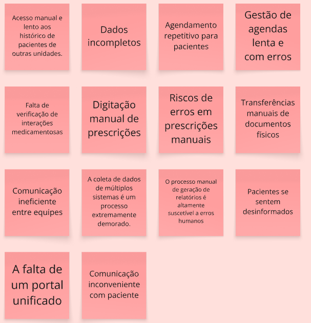

### 1.2 Expectativas da solução

Uma vez identificado os problemas, o sistema da HealthNet busca entregar os seguintes resultados:

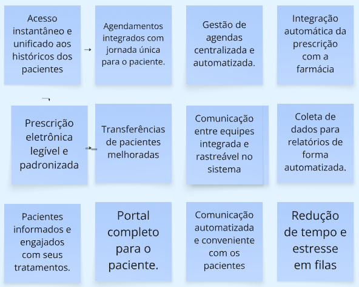

## 2. Personas & Features

As personas representam os usuários do sistema, e identificamos sua jornada (o que faz) de trabalho atual, e o que se espera com a solução.

### 2.1 Jornadas e Expectativas das Personas

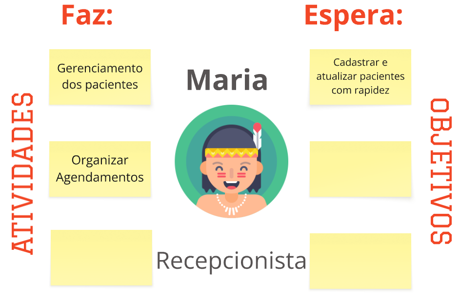

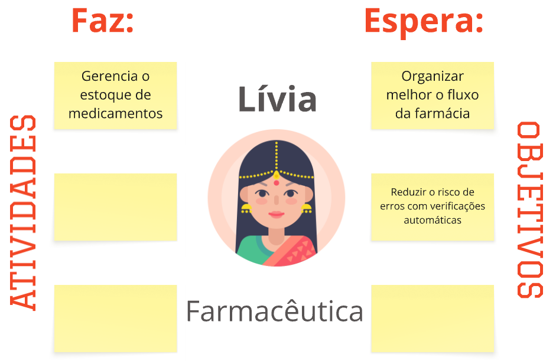

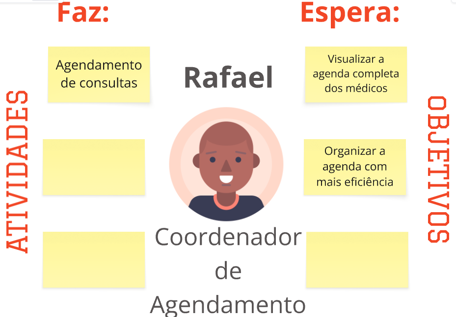

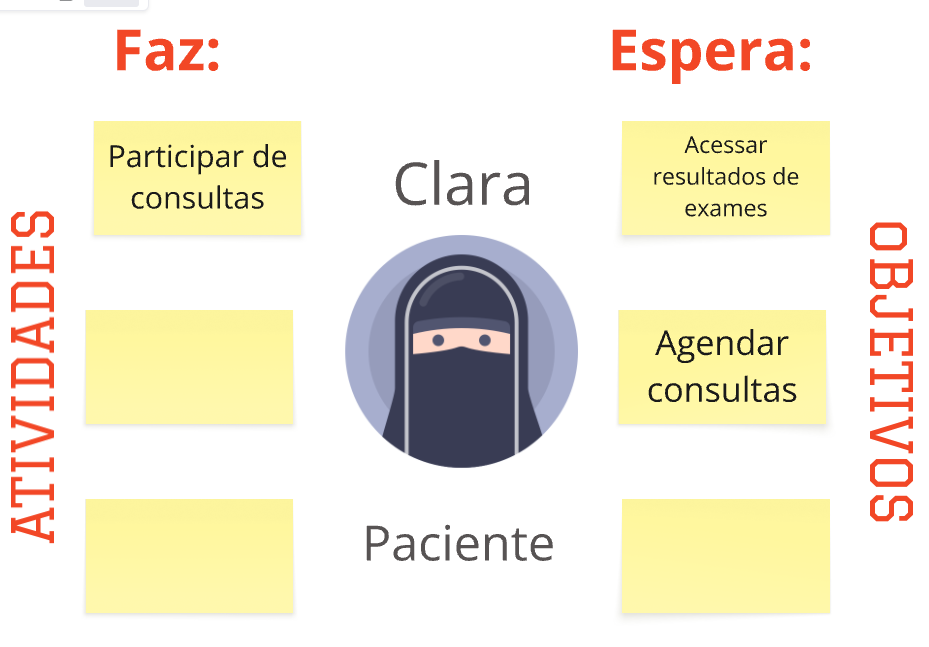

## 3. Features

Uma vez identificada as **Personas** e suas atividades, é possível organizar as **Features**, que são as macrofuncionalidades que o sistema possuirá, associando os **problemas** que cada Feature resolve e seus **benefícios**.

- `Recepcionista`
  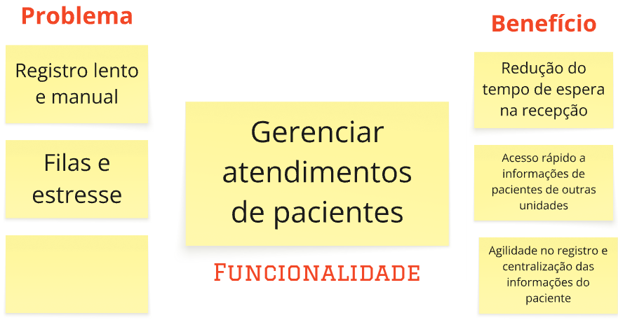

 

- `Médico`
  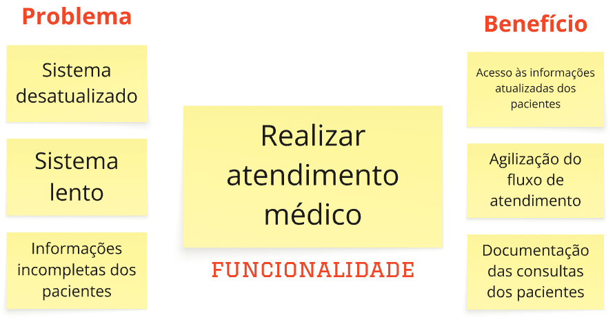

 

- `Farmacêutica`
  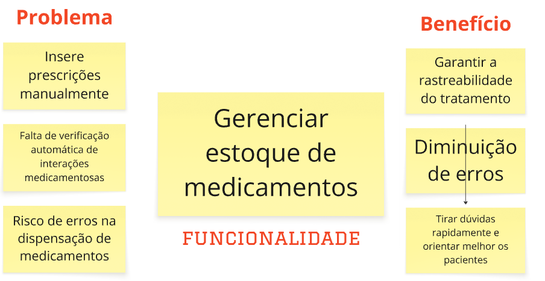

 

- `Coordenador`
  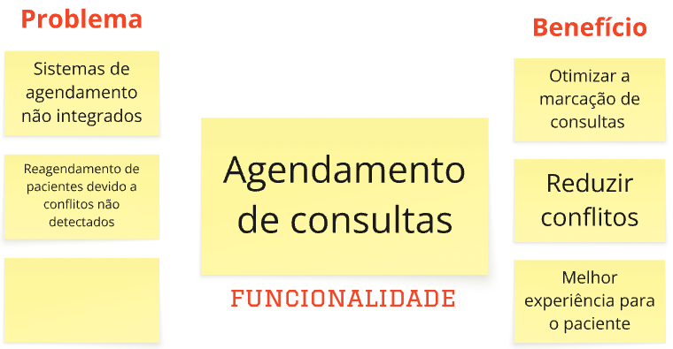

 

- `Paciente`
  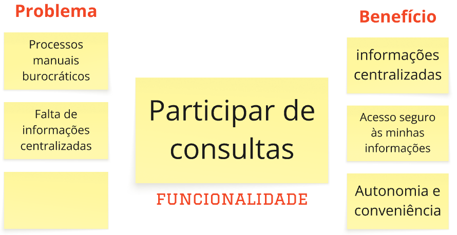

 

- `Diretor`
  

## 4. Product Backlog Item e COORG

Identificadas as <b>Features</b> do sistema, cada uma foi quebrada em microfuncionalidades com maior nível de granularidade, formando os <b>PBIs (Product Backlog Item)</b>. Eles são mais precisos que a <b>Feature</b>, e têm o papel de ajudar o desenvolvedor a entender exatamente o que deve ser construído.

---

### 4.1 Priorização

No projeto HealthNet, a priorização foi feita a partir da utilização do método COORG, que avalia os Product Backlog Items - PBI - pela suas pontuações em <b>Frequência de Uso</b> e seu <b>Valor de Negócio</b>, que são posteriormente somadas.

#### 4.1.1 Frequência de Uso

A frequência de uso é determinada com uma <b>nota de 1 à 5</b>, que varia conforme a descrição abaixo:

- **(5) Hora a Hora:** utilizado mais de uma vez ao dia.
- **(4) Diário:** utilizado uma vez no dia, pelo menos.
- **(3) Semanal:** utilizado uma, duas ou três vezes na semana.
- **(2) Mensal:** utilizado uma vez no mês, ou pouco mais de uma vez.
- **(1) Trimestral:** utilizado, pelo menos, uma vez a cada 3 meses.

#### 4.1.2 Valor de Negócio

Já o valor de negócio é determinado com uma <b>nota de 1 à 3</b>, que varia conforme descrição abaixo:

- **(3) Alto:** muito importante, principal, algo com um valor de negócio alto.
- **(2) Médio:** algo que tem relevância, um valor de negócio médio.
- **(1) Baixo:** algo que faz sentido, mas que não agrega muito valor no
  momento atual, um valor de negócio baixo.

#### 4.1.3 Pontuação Final

Valor_do_PBI = Valor de Negócio + Frequência de Uso

---

### 4.2 Listagem dos PBIs por Feature

#### 4.2.1 Feature: Gerenciar atendimento dos pacientes

<table style="width: 100%; border-collapse: collapse;">

  <thead>
    <tr style="background-color:rgb(72, 81, 161);">
      <th style="border: 1px solid #ccc; padding: 10px; text-align: center;">PBI</th>
      <th style="border: 1px solid #ccc; padding: 10px; text-align: center;">Priorização</th>
    </tr>
  </thead>

  <tbody>
    <tr>
      <td style="border: 1px solid #ccc; padding: 10px; text-align: center;">Registrar novos pacientes</td>
      <td style="border: 1px solid #ccc; padding: 10px; text-align: center;">7</td>
    </tr>
    <tr>
      <td style="border: 1px solid #ccc; padding: 10px; text-align: center;">Consultar pacientes registrados</td>
      <td style="border: 1px solid #ccc; padding: 10px; text-align: center;">6</td>
    </tr>
    <tr>
      <td style="border: 1px solid #ccc; padding: 10px; text-align: center;">Atualizar informações dos pacientes regulares</td>
      <td style="border: 1px solid #ccc; padding: 10px; text-align: center;">5</td>
    </tr>
  </tbody>
</table>

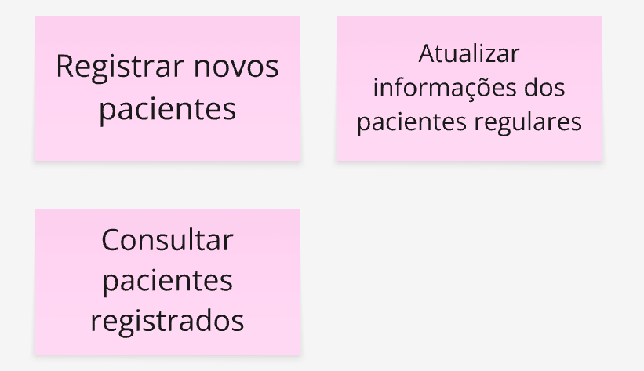

#### 4.2.2 Feature: Realizar atendimento médico

<table style="width: 100%; border-collapse: collapse;">

  <thead>
    <tr style="background-color:rgb(72, 81, 161);">
      <th style="border: 1px solid #ccc; padding: 10px; text-align: center;">PBI</th>
      <th style="border: 1px solid #ccc; padding: 10px; text-align: center;">Priorização</th>
    </tr>
  </thead>

  <tbody>
    <tr>
      <td style="border: 1px solid #ccc; padding: 10px; text-align: center;">Acessar históricos médicos dos pacientes</td>
      <td style="border: 1px solid #ccc; padding: 10px; text-align: center;">7</td>
    </tr>
    <tr>
      <td style="border: 1px solid #ccc; padding: 10px; text-align: center;">Gerar atestados</td>
      <td style="border: 1px solid #ccc; padding: 10px; text-align: center;">6</td>
    </tr>
    <tr>
      <td style="border: 1px solid #ccc; padding: 10px; text-align: center;">Prescrever medicamentos</td>
      <td style="border: 1px solid #ccc; padding: 10px; text-align: center;">6</td>
    </tr>
    <tr>
      <td style="border: 1px solid #ccc; padding: 10px; text-align: center;">Inserir notas de observações</td>
      <td style="border: 1px solid #ccc; padding: 10px; text-align: center;">5</td>
    </tr>
  </tbody>
</table>

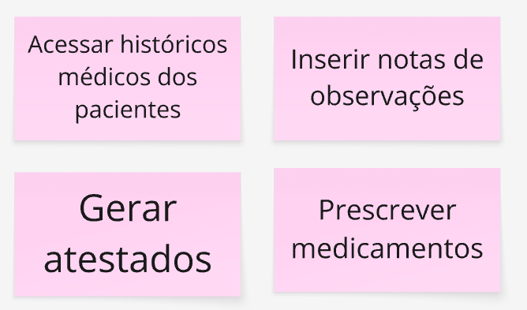

#### 4.2.3 Feature: Gerenciar estoque de medicamentos

<table style="width: 100%; border-collapse: collapse;">

  <thead>
    <tr style="background-color:rgb(72, 81, 161);">
      <th style="border: 1px solid #ccc; padding: 10px; text-align: center;">PBI</th>
      <th style="border: 1px solid #ccc; padding: 10px; text-align: center;">Priorização</th>
    </tr>
  </thead>

  <tbody>
    <tr>
      <td style="border: 1px solid #ccc; padding: 10px; text-align: center;">Dispensar medicamentos</td>
      <td style="border: 1px solid #ccc; padding: 10px; text-align: center;">7</td>
    </tr>
    <tr>
      <td style="border: 1px solid #ccc; padding: 10px; text-align: center;">Registrar medicamentos</td>
      <td style="border: 1px solid #ccc; padding: 10px; text-align: center;">6</td>
    </tr>
    <tr>
      <td style="border: 1px solid #ccc; padding: 10px; text-align: center;">Registrar dispensação no histórico do paciente</td>
      <td style="border: 1px solid #ccc; padding: 10px; text-align: center;">6</td>
    </tr>
        <tr>
      <td style="border: 1px solid #ccc; padding: 10px; text-align: center;">Imprimir etiqueta com instruções para o paciente</td>
      <td style="border: 1px solid #ccc; padding: 10px; text-align: center;">5</td>
    </tr>
        <tr>
      <td style="border: 1px solid #ccc; padding: 10px; text-align: center;">Consultar informações/bula do medicamento</td>
      <td style="border: 1px solid #ccc; padding: 10px; text-align: center;">5</td>
    </tr>
  </tbody>
</table>

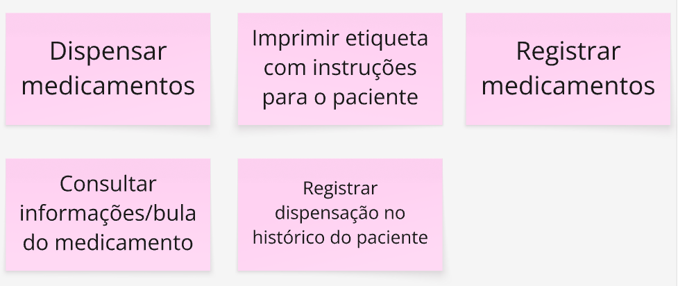

#### 4.2.4 Feature: Agendamento de consultas

<table style="width: 100%; border-collapse: collapse;">

  <thead>
    <tr style="background-color:rgb(72, 81, 161);">
      <th style="border: 1px solid #ccc; padding: 10px; text-align: center;">PBI</th>
      <th style="border: 1px solid #ccc; padding: 10px; text-align: center;">Priorização</th>
    </tr>
  </thead>

  <tbody>
    <tr>
      <td style="border: 1px solid #ccc; padding: 10px; text-align: center;">Cancelar ou remarcar uma consulta existente</td>
      <td style="border: 1px solid #ccc; padding: 10px; text-align: center;">7</td>
    </tr>
    <tr>
      <td style="border: 1px solid #ccc; padding: 10px; text-align: center;">Marcar nova consulta para um paciente</td>
      <td style="border: 1px solid #ccc; padding: 10px; text-align: center;">6</td>
    </tr>
    <tr>
      <td style="border: 1px solid #ccc; padding: 10px; text-align: center;">Visualizar agenda unificada de múltiplos médicos</td>
      <td style="border: 1px solid #ccc; padding: 10px; text-align: center;">6</td>
    </tr>
    <tr>
      <td style="border: 1px solid #ccc; padding: 10px; text-align: center;">Bloquear horários na agenda</td>
      <td style="border: 1px solid #ccc; padding: 10px; text-align: center;">5</td>
    </tr>
  </tbody>
</table>

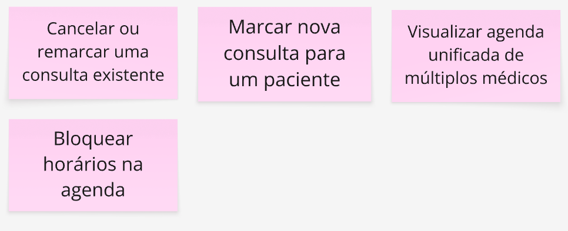

#### 4.2.5 Feature: Gerenciar atendimento dos pacientes

<table style="width: 100%; border-collapse: collapse;">

  <thead>
    <tr style="background-color:rgb(72, 81, 161);">
      <th style="border: 1px solid #ccc; padding: 10px; text-align: center;">PBI</th>
      <th style="border: 1px solid #ccc; padding: 10px; text-align: center;">Priorização</th>
    </tr>
  </thead>

  <tbody>
    <tr>
      <td style="border: 1px solid #ccc; padding: 10px; text-align: center;">Realizar login no portal</td>
      <td style="border: 1px solid #ccc; padding: 10px; text-align: center;">6</td>
    </tr>
    <tr>
      <td style="border: 1px solid #ccc; padding: 10px; text-align: center;">Realizar cadastro no portal</td>
      <td style="border: 1px solid #ccc; padding: 10px; text-align: center;">6</td>
    </tr>
    <tr>
      <td style="border: 1px solid #ccc; padding: 10px; text-align: center;">Realizar logout no portal</td>
      <td style="border: 1px solid #ccc; padding: 10px; text-align: center;">6</td>
    </tr>
    <tr>
      <td style="border: 1px solid #ccc; padding: 10px; text-align: center;">Agendar consultas no portal</td>
      <td style="border: 1px solid #ccc; padding: 10px; text-align: center;">5</td>
    </tr>
    <tr>
      <td style="border: 1px solid #ccc; padding: 10px; text-align: center;">Visualizar seu histórico de exames e laudos</td>
      <td style="border: 1px solid #ccc; padding: 10px; text-align: center;">5</td>
    </tr>
    <tr>
      <td style="border: 1px solid #ccc; padding: 10px; text-align: center;">Baixar resultados de exames</td>
      <td style="border: 1px solid #ccc; padding: 10px; text-align: center;">4</td>
    </tr>
    <tr>
      <td style="border: 1px solid #ccc; padding: 10px; text-align: center;">Visualizar suas próximas consultas</td>
      <td style="border: 1px solid #ccc; padding: 10px; text-align: center;">3</td>
    </tr>
    <tr>
      <td style="border: 1px solid #ccc; padding: 10px; text-align: center;">Atualizar dados cadastrais</td>
      <td style="border: 1px solid #ccc; padding: 10px; text-align: center;">3</td>
    </tr>
  </tbody>
</table>

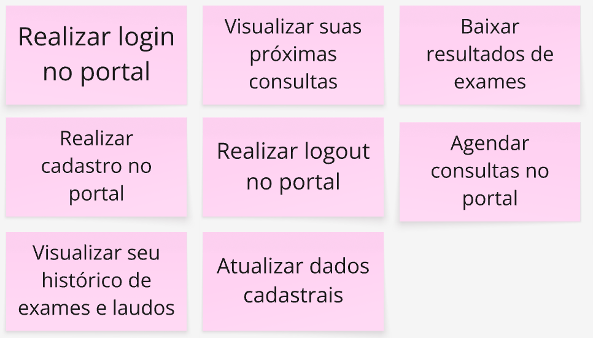

#### 4.2.6 Feature: Supervisionar a infraestrutura tecnológica

<table style="width: 100%; border-collapse: collapse;">

  <thead>
    <tr style="background-color:rgb(72, 81, 161);">
      <th style="border: 1px solid #ccc; padding: 10px; text-align: center;">PBI</th>
      <th style="border: 1px solid #ccc; padding: 10px; text-align: center;">Priorização</th>
    </tr>
  </thead>

  <tbody>
    <tr>
      <td style="border: 1px solid #ccc; padding: 10px; text-align: center;">Realizar Backups</td>
      <td style="border: 1px solid #ccc; padding: 10px; text-align: center;">7</td>
    </tr>
    <tr>
      <td style="border: 1px solid #ccc; padding: 10px; text-align: center;">Visualizar logs do sistema</td>
      <td style="border: 1px solid #ccc; padding: 10px; text-align: center;">7</td>
    </tr>
    <tr>
      <td style="border: 1px solid #ccc; padding: 10px; text-align: center;">Realizar restaurações do sistema</td>
      <td style="border: 1px solid #ccc; padding: 10px; text-align: center;">7</td>
    </tr>
    <tr>
      <td style="border: 1px solid #ccc; padding: 10px; text-align: center;">Emitir relatórios de desempenho</td>
      <td style="border: 1px solid #ccc; padding: 10px; text-align: center;">6</td>
    </tr>
    <tr>
      <td style="border: 1px solid #ccc; padding: 10px; text-align: center;">Monitorar o desempenho do sistema</td>
      <td style="border: 1px solid #ccc; padding: 10px; text-align: center;">6</td>
    </tr>
    <tr>
      <td style="border: 1px solid #ccc; padding: 10px; text-align: center;">Controlar permissões de acesso</td>
      <td style="border: 1px solid #ccc; padding: 10px; text-align: center;">4</td>
    </tr>
  </tbody>
</table>

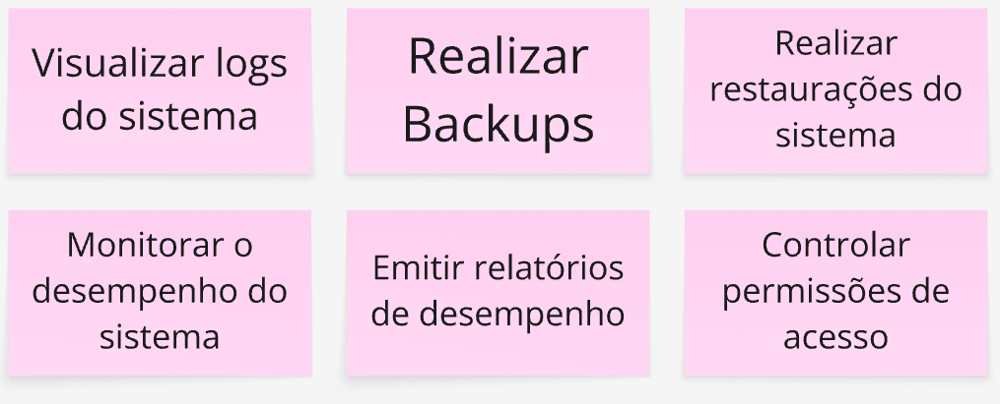

## 5. Histórias de Usuário e BDD

Nesta etapa, os <b>PBIs priorizados</b> foram refinados em <b>Histórias de Usuário</b>, com foco em representar claramente a perspectiva dos usuários e suas necessidades no uso do sistema. Para garantir que os requisitos estejam bem definidos e testáveis, cada história é complementada por critérios de aceitação escritos com base na técnica de <b>Behavior-Driven Development (BDD)</b>. Essa abordagem orientada a comportamento contribui para a construção de funcionalidades alinhadas aos objetivos de negócio e à experiência esperada pelo usuário final.

### 5. Relação de Histórias e BDD

<table style="width: 100%; border-collapse: collapse;">

  <thead>
    <tr style="background-color:rgb(72, 81, 161);">
      <th style="border: 1px solid #ccc; padding: 10px; text-align: center;">PBI</th>
      <th style="border: 1px solid #ccc; padding: 10px; text-align: center;">User Story</th>
      <th style="border: 1px solid #ccc; padding: 10px; text-align: center;">BDD</th>
    </tr>
  </thead>

  <tbody>
    <tr>
      <td style="border: 1px solid #ccc; padding: 10px; text-align: center;">Registrar novos pacientes</td>
      <td style="border: 1px solid #ccc; padding: 10px; text-align: center;">Eu, como recepcionista, quero registrar novos pacientes, para reduzir o tempo de espera na recepção.</td>
      <td style="border: 1px solid #ccc; padding: 10px; text-align: center;">Dado que a recepcionista está registrando o paciente utilizando o sistema, quando ela preenche os dados do novo paciente, então o paciente deve ser adicionado ao sistema e o tempo de espera na recepção deve ser reduzido.</td>
    </tr>
    <tr>
      <td style="border: 1px solid #ccc; padding: 10px; text-align: center;">Atualizar informações dos pacientes regulares</td>
      <td style="border: 1px solid #ccc; padding: 10px; text-align: center;">Eu, como recepcionista, quero atualizar informações dos pacientes regulares, para ter agilidade no registro e centralização das informações do paciente.</td>
      <td style="border: 1px solid #ccc; padding: 10px; text-align: center;">Dado que a recepcionista está logada no sistema e está na tela de cadastro do paciente, quando localiza o paciente pelo nome ou CPF e edita os campos de informações e confirma a atualização, então o sistema deve salvar os novos dados no cadastro do paciente e registrar a data e o usuário responsável pela alteração.</td>
    </tr>
    <tr>
      <td style="border: 1px solid #ccc; padding: 10px; text-align: center;">Consultar pacientes registrados</td>
      <td style="border: 1px solid #ccc; padding: 10px; text-align: center;">Eu, como recepcionista, quero consultar pacientes registrados, para ter acesso rápido a informações de pacientes de outras unidades.</td>
      <td style="border: 1px solid #ccc; padding: 10px; text-align: center;">Dado que a recepcionista está na tela de busca dos pacientes, quando ela digita o CPF de um paciente e confirma a busca, então os dados do paciente são mostrados na tela.</td>
    </tr>
    <tr>
      <td style="border: 1px solid #ccc; padding: 10px; text-align: center;">Acessar históricos médicos dos pacientes</td>
      <td style="border: 1px solid #ccc; padding: 10px; text-align: center;">Eu, como médico clínico geral, quero acessar históricos médicos dos pacientes, para ter acesso às informações atualizadas dos pacientes.</td>
      <td style="border: 1px solid #ccc; padding: 10px; text-align: center;">Dado que o médico clínico geral está atendendo um paciente, quando ele digita o CPF do paciente no sistema e confirma a busca, então o histórico médico completo dos pacientes é exibido.</td>
    </tr>
    <tr>
      <td style="border: 1px solid #ccc; padding: 10px; text-align: center;">Inserir notas de observações</td>
      <td style="border: 1px solid #ccc; padding: 10px; text-align: center;">Eu, como médico clínico geral, quero inserir notas de observações, para documentação das consultas dos pacientes.</td>
      <td style="border: 1px solid #ccc; padding: 10px; text-align: center;">Dado que o médico clínico está atendendo um paciente e está na ficha dele, quando ele digita uma observação no campo de notas e clica no botão "Salvar nota", então o sistema deve registrar a nota no histórico do paciente e exibir a nova observação na linha do tempo de atendimento</td>
    </tr>
    <tr>
      <td style="border: 1px solid #ccc; padding: 10px; text-align: center;">Gerar atestados</td>
      <td style="border: 1px solid #ccc; padding: 10px; text-align: center;">Eu, como médico clínico geral, quero gerar atestados, para agilização do fluxo de atendimento.</td>
      <td style="border: 1px solid #ccc; padding: 10px; text-align: center;">Dado que o médico clínico geral está realizando uma consulta médica, quando ele seleciona a opção de gerar atestado e preenche os dados, então um atestado válido deve ser gerado e salvo no sistema.</td>
    </tr>
    <tr>
      <td style="border: 1px solid #ccc; padding: 10px; text-align: center;">Prescrever medicamentos</td>
      <td style="border: 1px solid #ccc; padding: 10px; text-align: center;">Eu, como médico clínico geral, quero prescrever medicamentos, para agilização do fluxo de atendimento.</td>
      <td style="border: 1px solid #ccc; padding: 10px; text-align: center;">Dado o médico médico clínico geral está logado no sistema e está visualizando a ficha de um paciente durante uma consulta, quando ele seleciona a opção "Prescrever medicamento" e preenche o nome do medicamento, a dosagem e a duração do tratamento e clico em "Salvar prescrição", então o sistema deve registrar a prescrição no prontuário do paciente e exibir a prescrição na lista atual de medicamentos.</td>
    </tr>
    <tr>
      <td style="border: 1px solid #ccc; padding: 10px; text-align: center;">Dispensar medicamentos</td>
      <td style="border: 1px solid #ccc; padding: 10px; text-align: center;">Eu, como farmacêutica quero dispensar medicamentos, para diminuição de erros.</td>
      <td style="border: 1px solid #ccc; padding: 10px; text-align: center;">Dado que recebi uma prescrição médica no sistema, quando eu seleciono o medicamento e confirmo a dispensação, então o sistema deve registrar a saída e associar ao paciente e alertar se houver risco de erro ou interação.</td>
    </tr>
    <tr>
      <td style="border: 1px solid #ccc; padding: 10px; text-align: center;">Imprimir etiqueta com instruções para o paciente</td>
      <td style="border: 1px solid #ccc; padding: 10px; text-align: center;">Eu, como farmacêutica quero imprimir uma etiqueta com as instruções de uso do medicamento para tirar dúvidas rapidamente e orientar melhor os pacientes.</td>
      <td style="border: 1px solid #ccc; padding: 10px; text-align: center;">Dado que a farmacêutica está logada no sistema e está visualizando a prescrição médica de um paciente, quando seleciona a opção "Imprimir etiqueta" e revisa ou complementa as instruções de uso (como dosagem, horários e precauções), então o sistema deve gerar uma etiqueta com as instruções do medicamento e enviar a etiqueta para a impressora.</td>
    </tr>
    <tr>
      <td style="border: 1px solid #ccc; padding: 10px; text-align: center;">Registrar medicamentos</td>
      <td style="border: 1px solid #ccc; padding: 10px; text-align: center;">Eu, como farmacêutica quero registrar medicamentos para manter um registro preciso e garantir a rastreabilidade do tratamento.</td>
      <td style="border: 1px solid #ccc; padding: 10px; text-align: center;">Dado que que estou dispensando um medicamento, quando eu confirmo a entrega ao paciente, então o sistema deve atualizar automaticamente o histórico do paciente.</td>
    </tr>
    <tr>
      <td style="border: 1px solid #ccc; padding: 10px; text-align: center;">Consultar informações/bula do medicamento</td>
      <td style="border: 1px solid #ccc; padding: 10px; text-align: center;">Eu, como farmacêutica quero consultar as informações e a bula de um medicamento dentro do sistema para tirar dúvidas rapidamente e orientar melhor os pacientes.</td>
      <td style="border: 1px solid #ccc; padding: 10px; text-align: center;">Dado que a farmacêutica está logada no sistema e está na tela de prescrição ou dispensação de medicamentos, quando pesquisa pelo nome do medicamento e seleciona a opção "Ver bula", então o sistema deve exibir as informações completas do medicamento.</td>
    </tr>
    <tr>
      <td style="border: 1px solid #ccc; padding: 10px; text-align: center;">Registrar dispensação no histórico do paciente</td>
      <td style="border: 1px solid #ccc; padding: 10px; text-align: center;">Eu, como farmacêutica quero registrar a dispensação de um medicamento no histórico do paciente com um clique para garantir a rastreabilidade do tratamento.</td>
      <td style="border: 1px solid #ccc; padding: 10px; text-align: center;">Dado que finalizei a dispensação de um medicamento, quando eu clico na opção de imprimir instruções de uso, então uma etiqueta com a dose e modo de uso deve ser impressa.</td>
    </tr>
    <tr>
      <td style="border: 1px solid #ccc; padding: 10px; text-align: center;">Cancelar ou remarcar uma consulta existente</td>
      <td style="border: 1px solid #ccc; padding: 10px; text-align: center;">Eu, como coordenador de agendamento, quero cancelar ou remarcar a consulta de um paciente, para melhor experiência para o paciente.</td>
      <td style="border: 1px solid #ccc; padding: 10px; text-align: center;">Dado que o coordenador de agendamento está na agenda de um médico e a consulta está marcada para um horário específico, quando eu seleciono a opção "Remarcar" e escolho uma nova data e horário disponíveis, então o sistema deve atualizar o agendamento do paciente e enviar uma notificação ao paciente com os novos dados.</td>
    </tr>
    <tr>
      <td style="border: 1px solid #ccc; padding: 10px; text-align: center;">Marcar nova consulta para um paciente</td>
      <td style="border: 1px solid #ccc; padding: 10px; text-align: center;">Eu, como coordenador de agendamento quero marcar uma nova consulta para um paciente para melhor experiência para o paciente.</td>
      <td style="border: 1px solid #ccc; padding: 10px; text-align: center;">Dado que recebo a solicitação de agendamento de um paciente, quando eu seleciono um horário disponível e confirmo o agendamento, então a consulta deve ser adicionada à agenda do médico e o paciente deve receber a confirmação.</td>
    </tr>
    <tr>
      <td style="border: 1px solid #ccc; padding: 10px; text-align: center;">Visualizar agenda unificada de múltiplos médicos</td>
      <td style="border: 1px solid #ccc; padding: 10px; text-align: center;">Eu, como coordenador de agendamento quero visualizar a agenda unificada de múltiplos médicos para otimizar a marcação de consultas.</td>
      <td style="border: 1px solid #ccc; padding: 10px; text-align: center;">Dado que estou organizando agendamentos para pacientes com múltiplos especialistas, quando eu acesso a tela de agendas unificadas, então devo visualizar a disponibilidade de todos os médicos envolvidos e posso selecionar horários compatíveis para marcações otimizadas.</td>
    </tr>
    <tr>
      <td style="border: 1px solid #ccc; padding: 10px; text-align: center;">Bloquear horários na agenda</td>
      <td style="border: 1px solid #ccc; padding: 10px; text-align: center;">Eu, como coordenador de agendamento quero bloquear horários na agenda de um médico para reduzir conflitos.</td>
      <td style="border: 1px solid #ccc; padding: 10px; text-align: center;">Dado que um médico informa que estará indisponível em determinado horário, quando eu acesso a agenda dele e bloqueio o horário indicado, então esse horário não deve estar disponível para novos agendamentos.</td>
    </tr>
    <tr>
      <td style="border: 1px solid #ccc; padding: 10px; text-align: center;">Realizar login no portal</td>
      <td style="border: 1px solid #ccc; padding: 10px; text-align: center;">Eu, como paciente quero realizar um login  no portal, para ter acesso seguro às minhas informações.</td>
      <td style="border: 1px solid #ccc; padding: 10px; text-align: center;">Dado que estou na tela inicial do portal, quando eu insiro meu CPF e senha corretamente, então devo acessar o portal com segurança e ver minhas informações de saúde</td>
    </tr>
    <tr>
      <td style="border: 1px solid #ccc; padding: 10px; text-align: center;">Visualizar suas próximas consultas</td>
      <td style="border: 1px solid #ccc; padding: 10px; text-align: center;">Eu, como paciente quero visualizar minhas próximas consultas agendadas, para ter minhas informações centralizadas.</td>
      <td style="border: 1px solid #ccc; padding: 10px; text-align: center;">Dado que estou logada no portal como paciente, quando eu acesso a seção "Minhas consultas", então devo ver uma lista com datas, horários e nomes dos médicos agendados.</td>
    </tr>
    <tr>
      <td style="border: 1px solid #ccc; padding: 10px; text-align: center;">Baixar resultados de exames</td>
      <td style="border: 1px solid #ccc; padding: 10px; text-align: center;">Eu, como paciente quero baixar os resultados dos meus exames  para ter mais autonomia e conveniência.</td>
      <td style="border: 1px solid #ccc; padding: 10px; text-align: center;">Dado que estou na seção de exames, quando eu clico em "Baixar PDF" de um exame, então o sistema deve permitir o download do documento e o arquivo deve conter os dados médicos e a assinatura do responsável.</td>
    </tr>
    <tr>
      <td style="border: 1px solid #ccc; padding: 10px; text-align: center;">Realizar cadastro no portal</td>
      <td style="border: 1px solid #ccc; padding: 10px; text-align: center;">Eu, como paciente quero realizar um cadastro no portal, para ter acesso seguro às minhas informações.</td>
      <td style="border: 1px solid #ccc; padding: 10px; text-align: center;">Dado que estou na página de cadastro do portal, quando eu preencho meus dados pessoais e defino uma senha, então minha conta deve ser criada e devo receber um e-mail de confirmação de acesso.</td>
    </tr>
    <tr>
      <td style="border: 1px solid #ccc; padding: 10px; text-align: center;">Realizar logout no portal</td>
      <td style="border: 1px solid #ccc; padding: 10px; text-align: center;">Eu, como paciente quero realizar um logout no portal, para ter acesso seguro às minhas informações.</td>
      <td style="border: 1px solid #ccc; padding: 10px; text-align: center;">Dado que estou logado como paciente  no sistema, quando eu clico em “Sair”, então minha sessão deve ser encerrada e o sistema deve garantir que ninguém acesse minhas informações sem nova autenticação.</td>
    </tr>
    <tr>
      <td style="border: 1px solid #ccc; padding: 10px; text-align: center;">Agendar consultas no portal</td>
      <td style="border: 1px solid #ccc; padding: 10px; text-align: center;">Eu, como paciente quero agendar consultas no portal, para ter mais autonomia e conveniência.</td>
      <td style="border: 1px solid #ccc; padding: 10px; text-align: center;">Dado que estou logado como paciente no sistema, quando eu seleciono uma especialidade e escolho um horário disponível, então a consulta deve ser agendada e exibida nas minhas próximas consultas.</td>
    </tr>
    <tr>
      <td style="border: 1px solid #ccc; padding: 10px; text-align: center;">Visualizar seu histórico de exames e laudos</td>
      <td style="border: 1px solid #ccc; padding: 10px; text-align: center;">Eu, como paciente quero visualizar todo o meu histórico de exames e laudos médico, para ter minhas informações centralizadas.</td>
      <td style="border: 1px solid #ccc; padding: 10px; text-align: center;">Dado que estou logada no portal como paciente, quando eu acesso a seção de exames e laudos, então devo ver a lista completa dos exames realizados e seus respectivos resultados.</td>
    </tr>
    <tr>
      <td style="border: 1px solid #ccc; padding: 10px; text-align: center;">Atualizar dados cadastrais</td>
      <td style="border: 1px solid #ccc; padding: 10px; text-align: center;">Eu, como paciente quero atualizar meus dados cadastrais no portal para para ter mais autonomia e conveniência.</td>
      <td style="border: 1px solid #ccc; padding: 10px; text-align: center;">Dado que estou logada no portal, quando eu altero meus dados pessoais, então o sistema deve atualizar minhas informações com sucesso.</td>
    </tr>
    <tr>
      <td style="border: 1px solid #ccc; padding: 10px; text-align: center;">Visualizar logs do sistema</td>
      <td style="border: 1px solid #ccc; padding: 10px; text-align: center;">Eu, como Diretor de TI, quero visualizar os logs do sistema, para se ter eficiência operacional.</td>
      <td style="border: 1px solid #ccc; padding: 10px; text-align: center;">Dado que estou na área administrativa do sistema, quando eu acesso os logs de eventos, então devo ver registros de acesso, erros e alterações relevantes.</td>
    </tr>
    <tr>
      <td style="border: 1px solid #ccc; padding: 10px; text-align: center;">Realizar Backups</td>
      <td style="border: 1px solid #ccc; padding: 10px; text-align: center;">Eu, como Diretor de TI quero realizar backups para garantir a segurança e a integridade dos dados.</td>
      <td style="border: 1px solid #ccc; padding: 10px; text-align: center;">Dado que o sistema está em operação normal, quando eu inicio o processo de backup, então os dados devem ser salvos em um local seguro e uma notificação de sucesso deve ser gerada após cada backup.</td>
    </tr>
    <tr>
      <td style="border: 1px solid #ccc; padding: 10px; text-align: center;">Realizar restaurações do sistema</td>
      <td style="border: 1px solid #ccc; padding: 10px; text-align: center;">Eu, como Diretor de TI, quero realizar restaurações do sistema, para garantir a segurança e integridade dos dados.</td>
      <td style="border: 1px solid #ccc; padding: 10px; text-align: center;">Dado que ocorreu uma falha no sistema, quando eu seleciono o backup mais recente e inicio a restauração, então os dados e configurações devem ser recuperados com sucesso e o sistema deve voltar ao estado anterior à falha.</td>
    </tr>
    <tr>
      <td style="border: 1px solid #ccc; padding: 10px; text-align: center;">Monitorar o desempenho do sistema</td>
      <td style="border: 1px solid #ccc; padding: 10px; text-align: center;">Eu, como Diretor de TI quero monitorar o desempenho do sistema para garantir uma eficiência operacional.</td>
      <td style="border: 1px solid #ccc; padding: 10px; text-align: center;">Dado que o sistema está em funcionamento, quando eu abro o painel de desempenho, então devo ver métricas como uso de CPU, memória e tempo de resposta.</td>
    </tr>
    <tr>
      <td style="border: 1px solid #ccc; padding: 10px; text-align: center;">Emitir relatórios de desempenho</td>
      <td style="border: 1px solid #ccc; padding: 10px; text-align: center;">Eu, como Diretor de TI quero emitir relatórios de desempenho para garantir uma eficiência operacional.</td>
      <td style="border: 1px solid #ccc; padding: 10px; text-align: center;">Dado que o sistema coletou dados de uso, quando eu seleciono o período desejado e solicito o relatório, então um documento com estatísticas de desempenho deve ser gerado.</td>
    </tr>
    <tr>
      <td style="border: 1px solid #ccc; padding: 10px; text-align: center;">Controlar permissões de acesso</td>
      <td style="border: 1px solid #ccc; padding: 10px; text-align: center;">Eu, como Diretor de TI quero controlar permissões de acesso sistema para garantir a segurança e a integridade dos dados.</td>
      <td style="border: 1px solid #ccc; padding: 10px; text-align: center;">Dado que estou na área de controle de acesso, quando eu atribuo permissões específicas a um novo usuário, então ele deve ter acesso apenas às funcionalidades autorizadas.</td>
    </tr>
  </tbody>
</table>
