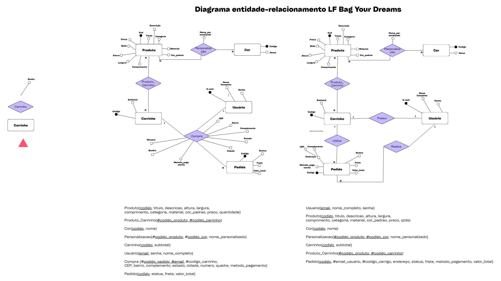

# Diagrama de Entidade-relacionamento - LF Bag Your Dreams

O diagrama Entidade-Relacionamento (DER) da aplicação **LF Bag Your Dreams** descreve a estrutura de dados envolvida no funcionamento de uma loja virtual de bolsas personalizadas. Ele modela as principais entidades, seus atributos e os relacionamentos entre elas. Abaixo está uma análise detalhada:

## Observações

- O modelo segue boas práticas de normalização, separando entidades e mantendo relacionamentos muitos-para-muitos através de entidades associativas como `Produto_Carrinho`.
- Entidades como `Compra`, `Utiliza`, e `Realiza` centralizam ações do usuário na loja.
- A personalização de produtos é implementada por meio de um relacionamento n-ário que considera cor e nome personalizado.
