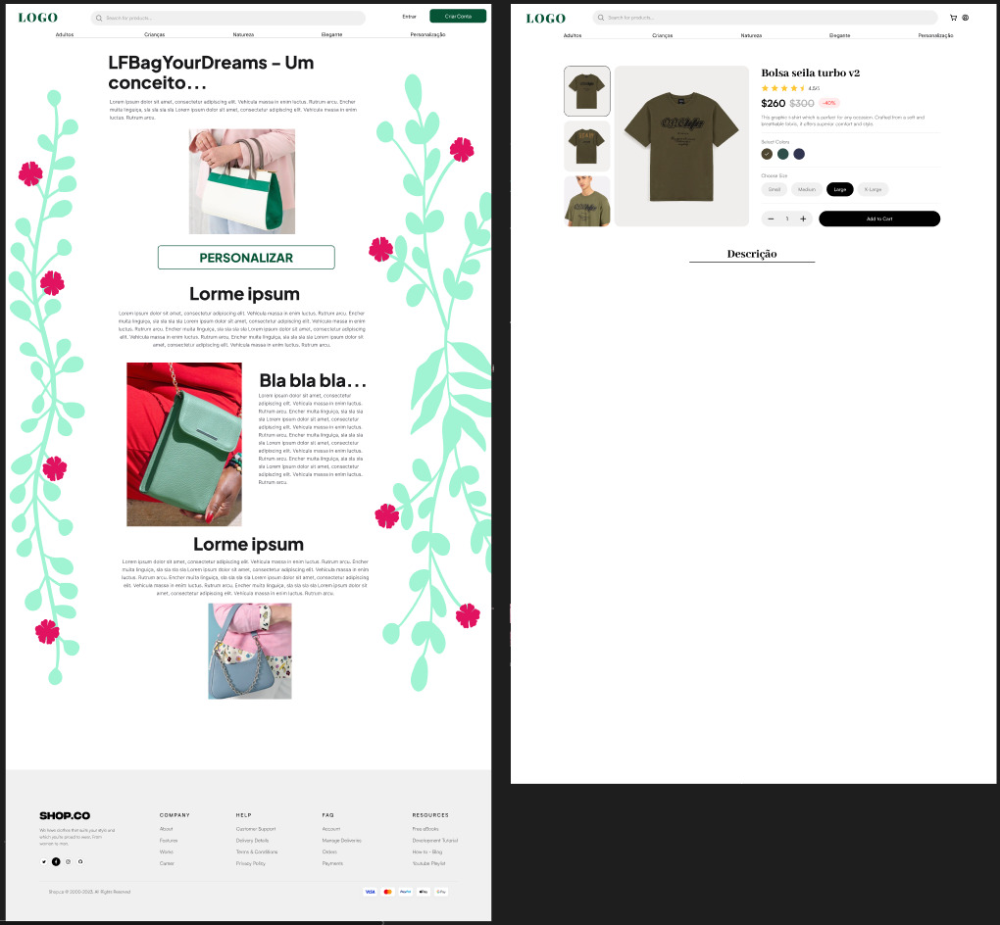
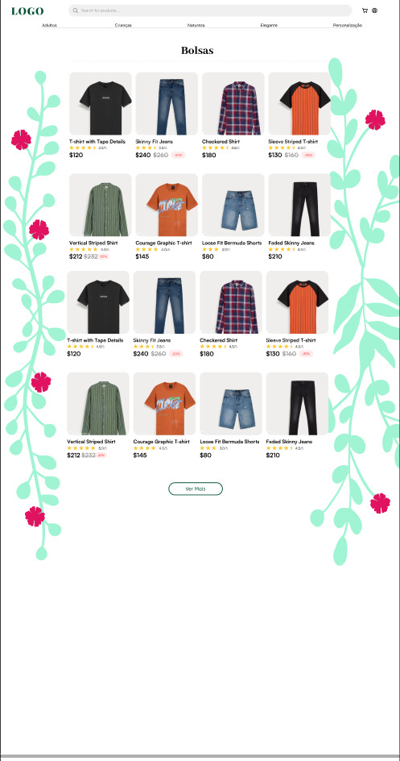
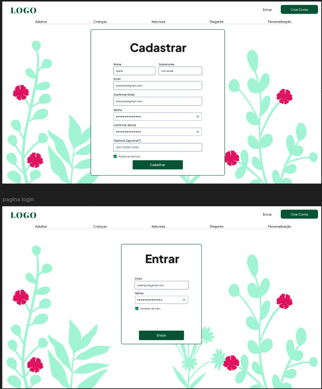
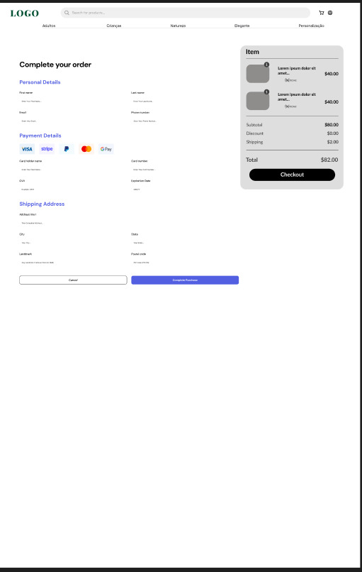
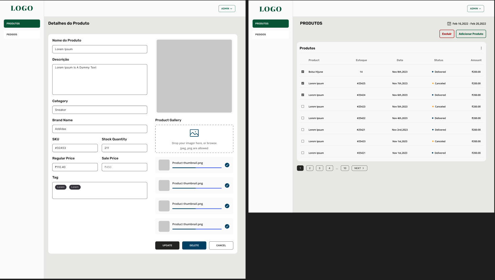
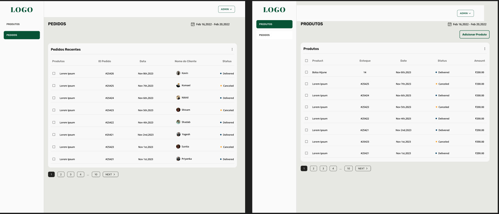

# Protótipo de Alta Fidelidade v1 - LF Bag Your Dreams

O protótipo de alta fidelidade da aplicação **LF Bag Your Dreams** representa os requisitos funcionais do projeto de maneira a permitir a compreensão visual do usuário acerca da interação que o software proporcionará e dos fluxos entre as funcionalidades;

 [Link do protótipo v1 no Figma](https://www.figma.com/design/lMqzfoqN3knhV5wo3JoW4h/Untitled?node-id=0-1&t=lQIwW46bwIB4Ehas-1)

## Observações

- Este protótipo de alta fidelidade foi um modelo elaborado integralmente pelos desenvolvedores da equipe LFB.
- O software implementado, contudo, apresenta uma interface adaptada a partir de modelos de protótipos existentes os quais permitiram à equipe uma implementação com maior agilidade, levando-se em consideração que, por questões de organização interna da equipe, não seria viável implementar, a tempo, todas as funcionalidades a partir de uma elaboração integral da interface por parte da equipe.
